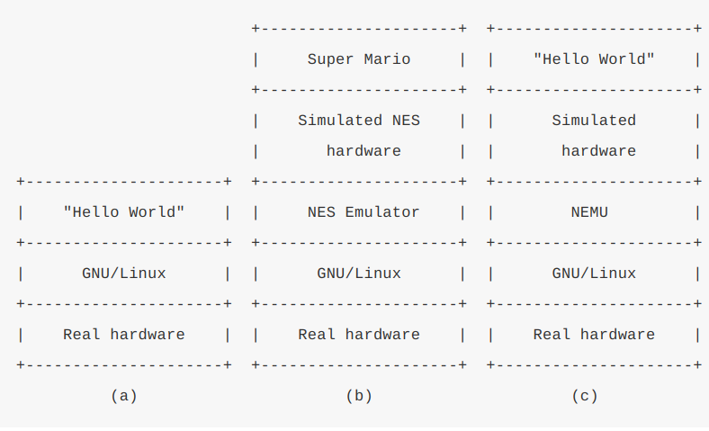
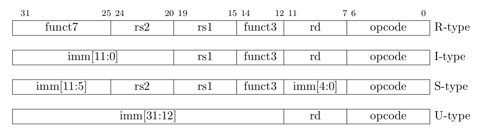
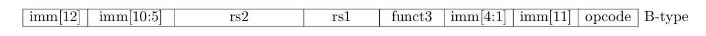
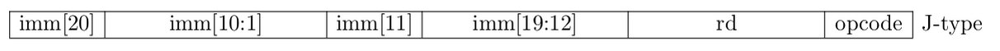
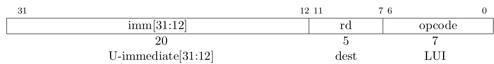
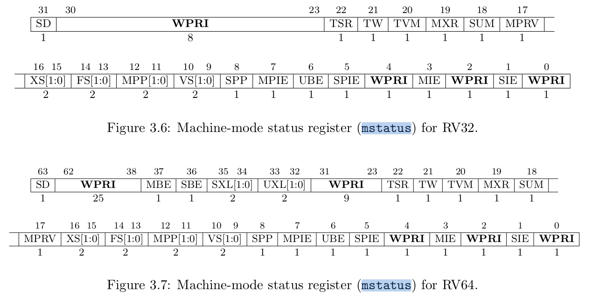

1. NEMU是什么？

一款经过简化的全系统模拟器


2. 什么是FCEUX？

https://github.com/NJU-ProjectN/fceux-am

红白机模拟器


3. 在fceux-am中体验超级马里奥


4. 基本编译加速方法：

```
lscpu
make -j?
```

先看有几个核，然后多和同时编译

加入

```
time
```

就可以查看编译时间


5. 加速编译！

```bash
apt-get install ccache
```

每次只编译有变动的文件，其他文件不发生变化！

```
man ccache
```

compiler cache


6. 找到gcc的位置

```
which gcc
```


7. 阅读 man ccache 对ccache进行配置

```
export PATH="/usr/lib/ccache:$PATH"
source ~/.bashrc
```

ccache：

https://blog.csdn.net/King_weng/article/details/117415618

环境变量：

https://blog.csdn.net/weixin_37825371/article/details/90752386


8. 马里奥的nes下载

https://www.retrowan.com/super-mario-bros/


9. 注意编译器的环境变量设置问题：

/etc/profile 是全局的，修改后需要重启才能生效！

~/.bashrc 是局部的，只需要 source ~/.bashrc 才能生效！


10. 运行马里奥！

make ARCH=native run mainargs=mario


11. 运行魂斗罗！

https://www.retrowan.com/contra/

make ARCH=native run mainargs=contra


12. NEMU 到底是什么？

一个用来执行其他程序的程序！


13. 三种执行程序的比较



a ：真实的硬件上跑一个linux，然后linux执行Hello World程序

b ：真实的硬件上跑一个linux，然后linux执行NES（红白机） 模拟器，然后在这个模拟器上跑超级马里奥

c ：真实的硬件上跑一个linux，然后linux上执行NEMU，NEMU模拟的硬件上执行Hello World程序


**可以发现NEMU 和 NES 的功能是一样的，都是模拟一个特定的硬件！**


14. NEMU 的模拟能力特别强，不仅可以跑RPG游戏仙剑，还可以跑文字冒险游戏！

https://baike.baidu.com/item/%E4%BB%99%E5%89%91%E5%A5%87%E4%BE%A0%E4%BC%A0/5129500#viewPageContent

https://baike.baidu.com/item/CLANNAD/25452


15. 选择指令集，推荐RISCV！


16. 到底什么是ISA？

- 一套规范！
- 一个软件和硬件的标准接口！
- 一本手册！


17. ==什么是编程模型？==


18. 指令？数据？


18. CPU、存储器、寄存器？


19. 是否可以不需要寄存器？


20. 程序计数器 PC（program counter）


21. 计算机做的事情特别简单：

```c
while (1) {
  从PC指示的存储器位置取出指令;
  执行指令;
  更新PC;
}
```


22. 1+2+...+100 的指令序列

```
// PC: instruction    | // label: statement
0: mov  r1, 0         |  pc0: r1 = 0;
1: mov  r2, 0         |  pc1: r2 = 0;
2: addi r2, r2, 1     |  pc2: r2 = r2 + 1;
3: add  r1, r1, r2    |  pc3: r1 = r1 + r2;
4: blt  r2, 100, 2    |  pc4: if (r2 < 100) goto pc2;   
// branch if less than
5: jmp 5              |  pc5: goto pc5;
```


23. 计算机就是一个数字逻辑电路：

加法器、计数器、寄存器、存储器

“存储程序”就是计算机的本质！


24. 如何理解程序是一个状态机？

指令就是状态的激励！

状态包括存储器、寄存器、PC的值！


状态集合有多少个呢？

就是 2^ {M} 个，M 表示 内存的bit数量+寄存器的bit数量

任何程序都是这个集合的子集！


25. 一个程序可以静态去考虑，也可以动态去考虑！

静态：指令序列！

动态：状态机的状态切换！


26. 图灵机

TRM 


27. 根目录结构

```
ics2022
├── abstract-machine   # 抽象计算机
├── am-kernels         # 基于抽象计算机开发的应用程序
├── fceux-am           # 红白机模拟器
├── init.sh            # 初始化脚本
├── Makefile           # 用于工程打包提交
├── nemu               # NEMU
└── README.md
```

monitor、CPU、memory、设备


28. monitor是什么？

一个方便调试NEMU的工具！

可以观察到计算机的运行状态！


29. NEMU的结构

```
nemu
├── configs                    # 预先提供的一些配置文件
├── include                    # 存放全局使用的头文件
│   ├── common.h               # 公用的头文件
│   ├── config                 # 配置系统生成的头文件, 用于维护配置选项更新的时间戳
│   ├── cpu
│   │   ├── cpu.h
│   │   ├── decode.h           # 译码相关
│   │   ├── difftest.h
│   │   └── ifetch.h           # 取指相关
│   ├── debug.h                # 一些方便调试用的宏
│   ├── device                 # 设备相关
│   ├── difftest-def.h
│   ├── generated
│   │   └── autoconf.h         # 配置系统生成的头文件, 用于根据配置信息定义相关的宏
│   ├── isa.h                  # ISA相关
│   ├── macro.h                # 一些方便的宏定义
│   ├── memory                 # 访问内存相关
│   └── utils.h
├── Kconfig                    # 配置信息管理的规则
├── Makefile                   # Makefile构建脚本
├── README.md
├── resource                   # 一些辅助资源
├── scripts                    # Makefile构建脚本
│   ├── build.mk
│   ├── config.mk
│   ├── git.mk                 # git版本控制相关
│   └── native.mk
├── src                        # 源文件
│   ├── cpu
│   │   └── cpu-exec.c         # 指令执行的主循环
│   ├── device                 # 设备相关
│   ├── engine
│   │   └── interpreter        # 解释器的实现
│   ├── filelist.mk
│   ├── isa                    # ISA相关的实现
│   │   ├── mips32
│   │   ├── riscv32
│   │   ├── riscv64
│   │   └── x86
│   ├── memory                 # 内存访问的实现
│   ├── monitor
│   │   ├── monitor.c
│   │   └── sdb                # 简易调试器
│   │       ├── expr.c         # 表达式求值的实现
│   │       ├── sdb.c          # 简易调试器的命令处理
│   │       └── watchpoint.c   # 监视点的实现
│   ├── nemu-main.c            # 你知道的...
│   └── utils                  # 一些公共的功能
│       ├── log.c              # 日志文件相关
│       ├── rand.c
│       ├── state.c
│       └── timer.c
└── tools                      # 一些工具
    ├── fixdep                 # 依赖修复, 配合配置系统进行使用
    ├── gen-expr
    ├── kconfig                # 配置系统
    ├── kvm-diff
    ├── qemu-diff
    └── spike-diff
```

- isa 和 非isa分开！
- 系统从main 开始执行！

```
nemu/src/nemu-main.c:main
```


30. kconfig 配置文件

```
nemu/Kconfig
```


31. 文件列表

filelist.mk


32. 构建规则

build.mk


33. 需要看的文件

nemu/include/generated/autoconf.h

nemu/include/config/auto.conf

nemu/src/monitor/monitor.c

nemu/include/macro.h

nemu/src/isa/$ISA/inst.c


34. monitor 的初始化工作？

```
init_monitor
	-> parse_args
	-> init_rand
	-> init_log
	-> init_mem
	
```


35. parse_args 调用了 getopt_long进行参数解析

```
man 3 getopt
```


36. monitor 初始化后就开始执行 engine_start


37. 给一个uint64 传递 一个 -1合法吗


38. 程序在main 返回的时候真的结束了吗？


39. 使用GDB 调试代码是一个更好理解框架代码的选择！


40. 配置NEMU

```
menuconfig
```

```
Build Options
  [*] Enable debug information
```


41. 优美地退出，不要让make报错 Error 1


42. 框架代码中体现的图灵机 思想

- 存储器是个在`nemu/src/memory/paddr.c`中定义的大数组
- PC和通用寄存器都在`nemu/src/isa/$ISA/include/isa-def.h`中的结构体中定义
- 加法器在... 嗯, 这部分框架代码有点复杂, 不过它并不影响我们对TRM的理解, 我们还是在PA2里面再介绍它吧
- TRM的工作方式通过`cpu_exec()`和`exec_once()`体现


43. 开发一个大的项目，一定要有一定的基础设施，不管是构建项目还是调试工具！

否则，一旦代码量上去，调试和维护的成本就十分高！


44. 使用GDB 可以观察NEMU的行为，但是NEMU 模拟执行的程序的行为由谁来观察呢？就是一个内嵌的SDB

simple debugger 


45. 完备的测试比盲目写代码更加重要！！！


46. 可能需要查询的资料

```
man readline
man strtok
man 3 str<TAB><TAB>
man strlen
man strcpy
man sscanf
```


47. 词法分析，正则表达式


48.  十进制整数的正则表达式

如果想在字符串中表示 `\+`，需要在前面加一个`\`，也就是`\\+`


49. BNF

```
<expr> ::= <number>    # 一个数是表达式
  | "(" <expr> ")"     # 在表达式两边加个括号也是表达式
  | <expr> "+" <expr>  # 两个表达式相加也是表达式
  | <expr> "-" <expr>  # 接下来你全懂了
  | <expr> "*" <expr>
  | <expr> "/" <expr>
```


50. 区分 () * ()  和 不合法表达式！


51. 多使用assert！


52. 区分减号和负号？

- **负号和减号都是`-`, 如何区分它们?**

减号的左侧是一个表达式

负号的左侧是一个运算符

- **负号是个单目运算符, 分裂的时候需要注意什么?**

负号的优先级比括号还要高


53. 运算符的优先级？

```
- + : 1 加减
* / : 2 乘除
() : 3 括号
- : 4 负号
```


54. 构造随机的样例进行测试！


55. 如何保证表达式全部是无符号运算？如何过滤除以0的行为？


56. 如何关闭warning？

-w的意思是关闭编译时的警告，也就是编译后不显示任何warning，因为有时在编译之后编译器会显示一些例如数据转换之类的警告，这些警告是我们平时可以忽略的。

-Wall选项意思是编译后显示所有警告。

-W选项类似-Wall，会显示警告，但是只显示编译器认为会出现错误的警告。

在编译一些项目的时候可以-W和-Wall选项一起使用。


57. 开启`-Wall -Werror` 让所有的warning 和 error都变成error，然后如果执行编译指令，那么system函数就会返回非0值！


58. 只需要用重定向就可以完成从文件input中获取数据的功能！

```
gcc ./tools/gen-expr/gen-expr.c -o ./tools/gen-expr/gen-expr
./tools/gen-expr/gen-expr 10000 > ./tools/gen-expr/input
make run < tools/gen-expr/input
```


59. 运算符的优先级问题！

https://zhuanlan.zhihu.com/p/132668250


60. 处理解引用符号 `*` 和 负号 `-` 是一样的！


61. 使用自动化工具进行自动测试是一个十分重要的方法和技巧！


62. 使用指针解引用`*`，如果是32位机器，就是取出一个32位，4个字节的数据，如果是64位机器，就是取出一个64为，8个字节的数据！


63. static 变量的用法


64. 调试技巧

```
- 总是使用`-Wall`和`-Werror`
- 尽可能多地在代码中插入`assert()`
- 调试时先启用sanitizer
- `assert()`无法捕捉到error时, 通过`printf()`输出可疑的变量, 期望能观测到error
- `printf()`不易观测error时, 通过GDB理解程序的精确行为
```


65. CPU每次执行完一条指令，都需要扫描所有的监视点的值，如果发现值发生了改变，就需要进行输出！


66. 可能同时触发两个监控点，可以按照监控点的序号进行处理！


67. 使用

```
__attribute__((used))
```

可以让static函数在编译阶段不报错！


68. 监视断点！

```
Error evaluating expression for watchpoint 2
value has been optimized out
Watchpoint 2 deleted.
0x000055555555ac26 in sdb_mainloop () at src/monitor/sdb/sdb.c:299
299       for (char *str; (str = rl_gets()) != NULL;)
```


69. 出现段错误，很有可能是对空指针NULL 进行了操作！

段错误一般是由于非法访存造成的。


70. 三种程序常见错误：

- Fault: 实现错误的代码, 例如`if (p = NULL)`
- Error: 程序执行时不符合预期的状态, 例如`p`被错误地赋值成`NULL`
- Failure: 能直接观测到的错误, 例如程序触发了段错误

我们需要从Failure 向上回溯，找到Fault！


71. 尽可能让Fault变成Error就是我们需要做的！


72. 让所有可能的错误都尽早体现，那么就更容易debug！

`-Wall`, `-Werror`: 在编译时刻把潜在的fault直接转变成failure.

assert、printf、GDB！


73. GDB 的段错误提示

Program received signal SIGSEGV, Segmentation fault.

会告知发生段错误的地方！


74. Address Sanitizer？

它可以自动地在指针和数组的访问之前插入用来检查是否越界的代码。

GCC 的编译选项？

-fsanitize=address


75. use-after-free？

在释放内存后依然使用内存！


76. 用监视点来模拟断点的功能:

```
w $pc == ADDR
```

就是监控PC寄存器的内容为某个指令的地址！

如果满足条件就触发了断点。


77. 模拟器(Emulator)和调试器(Debugger)？


78. GDB 可以在指令中间设置断点吗？


79. 运行大的程序，NEMU的速度会有明显下降？


80. GDB到底是如何调试程序的?

https://zhuanlan.zhihu.com/p/336922639


81. 如何快读阅读手册？

看目录，熟悉目录。

从粗到细，逐步缩小搜索的范围。

把查手册的工作看作是英语阅读理解。

快速阅读和关键字表达能力。


82. 手册阅读练习。

- **riscv32有哪几种指令格式?**








- **LUI指令的行为是什么?**

LUI (load upper immediate) is used to build 32-bit constants and uses the U-type format. 

LUI places the 32-bit U-immediate value into the destination register rd, filling in the lowest 12 bits with zeros.




- **mstatus寄存器的结构是怎么样的?**




83. 统计 `c` 文件和 `h` 文件的代码行数

make count

```
// 包括空行
count_c: 
	@wc -l `find ./ -name *.c`
count_h:
	@wc -l `find ./ -name *.h`

// 包括空行
COUNT_C := $(shell  find . -name "*.c" | xargs grep -v "^$$" | wc -l)  
COUNT_H := $(shell  find . -name "*.h" | xargs grep -v "^$$" | wc -l)  

count_c:
	@echo $(COUNT_C)

count_h:
	@echo $(COUNT_H)
```


C 代码行数：19279，增加了715行

头文件行数：2400，增加了18行


