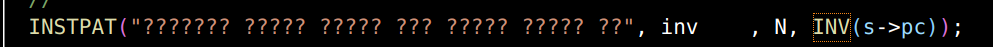
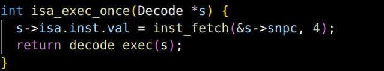
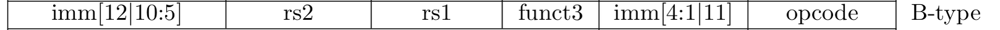
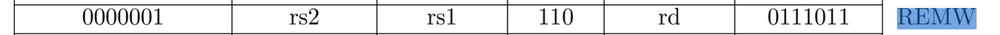
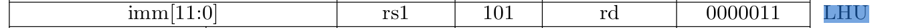
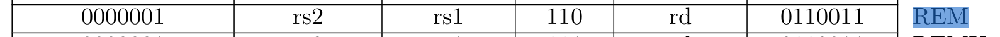
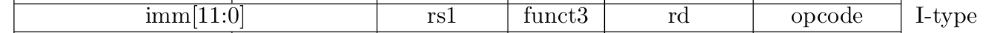

1. **计算机就是一个冰冷的机器，只会重复做下面的事情：**

取指、译码、执行


2. **什么是取指？**

取指(instruction fetch， IF)

根据PC所表示的地址，从内存中取出内容，这个内容就是指令。


3. **什么是译码？**

译码(instruction decode， ID)

指令本身就是一个01串，根据指令集的规则，将01串翻译出操作数和操作码就是译码的过程！

指令本身就是一个如何对数据进行运算的抽象！


得到操作数和操作码！！！


4. **什么是执行指令？**

 执行(execute， EX)

根据译码的结果对数据进行操作！

比如是加法指令，就是将操作数进行加法操作后，将结果写回！


5. **什么是更新PC？**

CPU 执行完当前指令后，就将PC加上刚执行完的指令的长度！


6. **一个最简单的指令集需要哪些内容？**

加法指令。可以变成减法指令（转化为补码运算），可以模拟乘法。

跳转指令。可以实现函数调用，循环，分支，递归。

读取和写入内存的指令。

```c
#include <stdint.h>
#include <stdio.h>

#define NREG 4
// 4 个寄存器
#define NMEM 16
// 16 字节的内存空间

// 定义指令格式
typedef union {
  struct { uint8_t rs : 2， rt : 2， op : 4; } rtype;
  // 2 + 2 + 4
  struct { uint8_t addr : 4      ， op : 4; } mtype;
  // 4 + 4
  uint8_t inst;
  // 指令寄存器（存放从内存读取到的指令）
} inst_t;

#define DECODE_R(inst) uint8_t rt = (inst).rtype.rt， rs = (inst).rtype.rs
// R型指令译码
// rs 和 rt寄存器
#define DECODE_M(inst) uint8_t addr = (inst).mtype.addr
// M型指令译码
// 操作的地址 addr

uint8_t pc = 0;       // PC， C语言中没有4位的数据类型， 我们采用8位类型来表示
uint8_t R[NREG] = {}; // 寄存器
uint8_t M[NMEM] = {   // 内存， 其中包含一个计算z = x + y的程序
  0b11100110，  // load  6#     | R[0] <- M[y]
  0b00000100，  // mov   r1， r0 | R[1] <- R[0]
  0b11100101，  // load  5#     | R[0] <- M[x]
  0b00010001，  // add   r0， r1 | R[0] <- R[0] + R[1]
  0b11110111，  // store 7#     | M[z] <- R[0]
  0b00010000，  // x = 16
  0b00100001，  // y = 33
  0b00000000，  // z = 0
};

int halt = 0; // 结束标志

// 执行一条指令
void exec_once() {
  inst_t this;
  this.inst = M[pc]; // 取指
  switch (this.rtype.op) {
  	//  操作码译码       操作数译码           执行
    case 0b0000: { DECODE_R(this); R[rt]   = R[rs];   break; }
    case 0b0001: { DECODE_R(this); R[rt]  += R[rs];   break; }
    case 0b1110: { DECODE_M(this); R[0]    = M[addr]; break; }
    case 0b1111: { DECODE_M(this); M[addr] = R[0];    break; }
    default:
      printf("Invalid instruction with opcode = %x， halting...\n"， this.rtype.op);
      halt = 1;
      break;
  }
  pc ++; // 更新PC
}

int main() {
  while (1) {
    exec_once();
    if (halt) break;
  }
  printf("The result of 16 + 33 is %d\n"， M[7]);
  return 0;
}
```


7. **如何分析一个ISA指令手册**

- 分析每一条指令具体行为的描述
- 分析指令opcode的编码表格


8. **RISC vs. CISC**

RISC的宗旨就是简单，指令少，指令长度固定，指令格式统一。

https://blog.sciencenet.cn/blog-414166-763326.html

https://blog.sciencenet.cn/blog-414166-1089206.html

CISC的一个特性，不惜使用复杂的指令格式，牺牲硬件的开发成本，

也要使得一条指令可以多做事情，从而提高代码的密度，减小程序的大小。


9. **NEMU 的API手册，主要是一些结构体、数据、函数的功能说明！**


10.  **exec_once() 函数覆盖了指令周期的所有阶段: 取指，译码，执行**


11. **使用模式匹配进行译码**

- `0`表示相应的位只能匹配`0`
- `1`表示相应的位只能匹配`1`
- `?`表示相应的位可以匹配`0`或`1`
- 空格是分隔符， 只用于提升模式字符串的可读性， 不参与匹配

1. 指令名称
2. 指令类型
3. 指令执行操作


12. **为什么需要有下一条指令的地址？**

方便进行PC的更新


13. **标签地址？**

https://gcc.gnu.org/onlinedocs/gcc/Labels-as-Values.html


14. **安装必要的软件**

```
sudo apt-get install g++-riscv64-linux-gnu binutils-riscv64-linux-gnu
```


15. **编译程序，并使用NEMU运行程序**

```
bash init.sh am-kernels
```

在am-kernels/tests/cpu-tests/目录下键入

```
make ARCH=$ISA-nemu ALL=dummy run
```

如果选择的是riscv64，那么就是

```
make ARCH=riscv64-nemu ALL=dummy run
```


read the friendly manual !

多读手册！


16. **为什么有指令没有实现的时候会进入invalid_inst ?**



似乎就是发现所有译码规则都没有满足，于是就失败了。。。


17. **取指 + 译码 + 执行都是下面这个函数**




18. **取pc，更新pc，就是下面这三行！**


19. **注意立即数   字节的顺序问题，尤其是大小端的问题！**

如果NEMU需要模拟一个大端模式的指令集，那么就需要每次在访问多个字节的时候进行逆序处理？


20. **CISC 取指令 和 RISC 取指令有什么不同？**

x86：指令形式需要一边取指一边译码来确定

RISCV：可以泾渭分明地处理取指和译码阶段


21. **宏定义嵌套太多层？让GCC帮助将宏展开，然后将结果输入到一个文件里面！**


22. **对一个项目的掌握？**

- 刚接触一个新项目，不知道如何下手。
- RTFM，RTFSC，大致明白项目组织结构和基本的工作流程。
- 运行项目的时候发现有非预期行为(可能是配置错误或环境错误，可能是和已有项目对接出错，也可能是项目自身的bug)，然后调试。在调试过程中，对这些模块的理解会逐渐变得清晰。
- 哪天需要你在项目中添加一个新功能，你会发现自己其实可以胜任。


23. **snpc和dnpc的不同？**

`snpc`是下一条静态指令，而`dnpc`是下一条动态指令。

对于顺序执行的指令，它们的`snpc`和`dnpc`是一样的；但对于跳转指令，`snpc`和`dnpc`就会有所不同。

`dnpc`应该指向跳转目标的指令。

显然，我们应该使用`s->dnpc`来更新PC，并且在指令执行的过程中正确地维护`s->dnpc`。


24. **伪指令(pseudo instruction)？**

addi 就是一个伪指令！


25. **在 RV32/64G Instruction Set Listings 中速查指令！**

rs1 和 rs2 的位置是固定的，且两者都是5个bit。

imm 长度不固定。


26. **需要实现的指令？**


```
00000413          	li	s0，0
== 
00000413 addi    s0， zero， 0
```


**LUI (load upper immediate)** is used to build 32-bit constants and uses the U-type format. LUI places the 32-bit U-immediate value into the destination register rd， filling in the lowest 12 bits with zeros

rd寄存器中的低12位为0，高20位为立即数 imm！


类似的还有AUIPC：


==ADDI指令==

```
00000413 addi    s0， zero， 0
```


ADDI adds the sign-extended 12-bit immediate to register rs1. Arithmetic overflow is ignored and the result is simply the low XLEN bits of the result. **ADDI rd， rs1， 0 is used to implement the MV rd， rs1 assembler pseudo instruction.**

rd = rs1 + imm


==JAL指令==

```
00c000ef          	jal	ra，80000018
```


The jump and link (JAL) instruction uses the J-type format， where the J-immediate encodes a signed offset in multiples of 2 bytes. The offset is sign-extended and added to the address of the jump instruction to form the jump target address. Jumps can therefore target a ±1 MiB range.

JAL stores the address of the instruction that follows the JAL (pc+4) into register rd. The standard software calling convention uses x1 as the return address register and x5 as an alternate link register.

```
JAL rd，offset
x[rd] = pc+4; pc += sext(offset);
```

// sext 表示有符号扩展


PC 都是jal这条指令的地址！

```
00c000ef
0 000_0000_1100_0000_0000_0000_1110_1111
```

00000_0000  0  0000000110 0


fe9ff0ef

1111_1110_1001_1111_1111  _0000_1110_1111

1fffe8


-1-7-16 = -24


==JALR指令==

```
???
```


The indirect jump instruction JALR (jump and link register) uses the I-type encoding. 

The target address is obtained by adding the **sign-extended** 12-bit I-immediate to the register rs1， then setting the least-significant bit of the result to zero. The address of the instruction following the jump (pc+4) is written to register rd. Register x0 can be used as the destination if the result is not required.

该指令将PC设置为rs1寄存器中的值加上符号位扩展的偏移量，把计算出地址的最低有效位设为0，并将原PC + 4的值写入rd寄存器。如果不需要目的寄存器，可以将rd设置为x0。

t = pc + 4; 

pc = (x[rs1]+sext(offset)) & ~1; 

x[rd]=t 


ret 指令，伪指令

```
00008067 jalr    zero， 0(ra)
```


==EBREAK 指令==


The EBREAK instruction is used to return control to a debugging environment.


27. **执行完指令后，需要保证a0寄存器中的值为0**

addi，jar 还有jarl 这三个指令一定要实现正确！


28. **add-longlong 测试需要的指令**

==ADD指令==


ADD performs the addition of rs1 and rs2. 

Overflows are ignored and the low XLEN bits of results are written to the destination rd.


==SUB指令==


SUB performs the subtraction of rs2 from rs1. 

Overflows are ignored and the low XLEN bits of results are written to the destination rd.


伪指令

```
seqz	a0，a0
```

实际是`sltiu`


==SLTIU指令==


SLTI (set less than immediate) places the value 1 in register rd if register rs1 **is less than** the sign-extended immediate when both are treated as signed numbers， else 0 is written to rd. 

SLTIU is similar but compares the values as unsigned numbers (i.e.， the immediate is first sign-extended to XLEN bits then treated as an unsigned number). 

Note， ==SLTIU rd， rs1， 1 sets rd to 1 if rs1 equals zero， otherwise sets rd to 0== 

(assembler pseudo instruction **SEQZ rd， rs**).

```
00153513
0000_0000_0001_0101_0011_0101_0001_0011

0000_0000_0001  01010   011  01010   0010011
```


==BEQ指令==  和 ==BNE指令==

beqz 是它的伪指令！

```
00050463          	beqz	a0，80000018

0000_000  00000  01010  000_0100_0110_0011

```


All branch instructions use the B-type instruction format. The 12-bit B-immediate encodes signed offsets in multiples of 2 bytes. **The offset is sign-extended and added to the address of the branch instruction to give the target address**. The conditional branch range is ±4 KiB.

Branch instructions compare two registers. 

BEQ and BNE take the branch **if registers rs1 and rs2 are equal or unequal respectively**. 

BLT and BLTU take the branch if rs1 is less than rs2， using signed and unsigned comparison respectively. 

BGE and BGEU take the branch if rs1 is greater than or equal to rs2， using signed and unsigned comparison respectively. Note， BGT， BGTU， BLE， and BLEU can be synthesized by reversing the operands to BLT， BLTU， BGE， and BGEU， respectively.

fe8990e3

1111_1110_1000_1001_1001_0000_1110_0011


fd8a12e3

1111_110  1_1000  _1010_0   001_0010_1110_0011

24 

20


==ADDIW指令==

```
008a0a1b          	addiw	s4，s4，8
```


ADDIW is an RV64I instruction that **adds the sign-extended 12-bit immediate to register rs1 and produces the proper sign-extension of a 32-bit result in rd.** 

Overflows are ignored and the result is the low 32 bits **of the result sign-extended to 64 bits**. Note， ADDIW rd， rs1， 0 writes the sign-extension of the lower 32 bits of register rs1 into register rd 

 **(assembler pseudo instruction SEXT.W).**


008a0a1b

000000001000    10100     000    10100    0011011


$a0

0 1 

0x4bd2243c

0x41218042


0xffffffff

0xfffffffd

0xfffffffe

fffffffffffffffe


add-longlong


29. **add 测试需要的指令**

==LW指令？==

```
000aa903          	lw	s2，0(s5)
```

Load and store instructions **transfer a value between the registers and memory.** 

Loads are encoded in the **I-type** format and **stores are S-type**. 

The effective address is obtained by adding register rs1 to the sign-extended 12-bit offset. Loads copy a value from memory to register rd. 

Stores copy the value in register rs2 to memory.

**The LW instruction loads a 32-bit value from memory into rd.** 

LH loads a 16-bit value from memory， then sign-extends to 32-bits before storing in rd. 


记得进行符号扩展！


==ADDW指令？==

```
0125053b          	addw	a0，a0，s2
```


ADDW and SUBW are RV64I-only instructions that are defined analogously to ADD and SUB but operate on 32-bit values and produce signed 32-bit results.

Overflows are ignored， and the low 32-bits of the result is sign-extended to 64-bits and written to the destination register.


记得进行符号扩展！


30. **bit 测试添加的指令**


==SH指令==

```
00f11423          	sh	a5，8(sp)
```


LB and LBU are defined **analogously** for 8-bit values. 

The SW， SH， and SB instructions store 32-bit， **16-bit**， and 8-bit values from the low bits of register rs2 to memory.


==SRAI指令==

```
4035d793          	srai	a5，a1，0x3
```


Shifts by a constant are encoded as a specialization of the **I-type format**. 

The operand to be shifted is in rs1， and the shift amount is encoded **in the lower 5 bits of the I-immediate field**. The right shift type is encoded **in bit 30.** 

- SLLI is a logical left shift (zeros are shifted into the lower bits); 
- SRLI is a logical right shift (**zeros** are shifted into the upper bits); 
- SRAI is an **arithmetic right shift** (the original **sign bit** is copied into the vacated upper bits).


==LBU指令==

```
00054503          	lbu	a0，0(a0)
```


LB and LBU are defined analogously **for 8-bit values**. The SW， SH， and SB instructions store 32-bit， 16-bit， and 8-bit values from the low bits of register rs2 to memory.


==ANDI指令==


ANDI， ORI， XORI are logical operations that perform bitwise AND， OR， and XOR on register rs1 and the sign-extended 12-bit immediate and place the result in rd. 

Note， XORI rd， rs1， -1 performs a bitwise logical inversion of register rs1

 **(assembler pseudo instruction NOT rd， rs).**


==SLLW指令==

```
00b797bb          	sllw	a5，a5，a1
```


SLLW， SRLW， and SRAW are RV64I-only instructions that are analogously defined **but operate on 32-bit values and sign-extend their 32-bit results to 64 bits.** 

The shift amount is given by **rs2[4:0].**


logical left !

**SLL， SRL， and SRA** perform **logical left， logical right， and arithmetic right shifts** on the value in register rs1 by the shift amount held in register rs2. In RV64I， only the **low 6 bits of rs2** are considered for the shift amount


==AND指令==

```
00f57533          	and	a0，a0，a5
```


AND， OR， and XOR perform bitwise logical operations


==SLTU指令==

```
00a03533          	snez	a0，a0
```


又是一个伪指令。

SLT and SLTU perform signed and unsigned compares respectively， writing 1 to rd if rs1 < rs2， 0 otherwise. 

Note， SLTU rd， x0， rs2 sets rd to 1 if rs2 is not equal to zero， otherwise sets rd to zero (**assembler pseudo instruction SNEZ rd， rs**). 


==XORI指令==

```
00154513          	xori	a0，a0，1
```


ANDI， ORI， XORI are logical operations that perform bitwise AND， OR， and XOR on register rs1 and the sign-extended 12-bit immediate and place the result in rd. 

Note， XORI rd， rs1， -1 performs a bitwise logical inversion of register rs1

 **(assembler pseudo instruction NOT rd， rs).**


==OR指令==

```
00e7e7b3          	or	a5，a5，a4
```


AND， OR， and XOR perform bitwise logical operations


==SB指令==

```
00f70023          	sb	a5，0(a4)
```


The SD， SW， SH， and SB instructions store 64-bit， 32-bit， 16-bit， and **8-bit** values from the low bits of register rs2 to memory respectively.


31. **bubble-sort 测试需要的指令**


==SLLI指令==

```
00b797bb          	sllw	a5，a5，a1
```


SLLI is a **logical left shift** (zeros are shifted into the lower bits); 

SRLI is a logical right shift (zeros are shifted into the upper bits); 

SRAI is an arithmetic right shift (the original sign bit is copied into the vacated upper bits).

Shifts by a constant are encoded as a specialization of the I-type format using the same instruction opcode as RV32I. 

The operand to **be shifted is in rs1， and the shift amount is encoded in the lower 6 bits of the I-immediate field for RV64I**. The right shift type is encoded in **bit 30**.


==BGE指令==

```
00e6d663          	bge	a3，a4，80000064
```


**BGE** and BGEU take the branch **if rs1 is greater than or equal to rs2**， using **signed** and unsigned comparison respectively. Note， BGT， BGTU， BLE， and BLEU can be **synthesized** by reversing the operands to BLT， BLTU， BGE， and BGEU， respectively.


==SW指令==

```
00d7a023          	sw	a3，0(a5)
```


The SW， SH， and SB instructions store **32-bit**， 16-bit， and 8-bit values from the low bits of register rs2 to memory.


32. **crc32 测试需要的指令**

==LUI指令==

```
edb88337          	lui	t1，0xedb88
```


LUI (**load upper immediate**) is used to build 32-bit constants and uses the U-type format. 

LUI places the 32-bit U-immediate value into the destination register rd， filling in the lowest 12 bits with zeros.


==SRLIW指令==

```
0017d69b          	srliw	a3，a5，0x1
```


SLLIW， **SRLIW**， and SRAIW are RV64I-only instructions that are analogously defined but operate on **32-bit values and sign-extend their 32-bit results to 64 bits**. SLLIW， SRLIW， and SRAIW encodings with **imm[5] ̸= 0 are reserved**.

Previously， SLLIW， SRLIW， and SRAIW with **imm[5] ̸= 0** were defined to cause illegal in-
struction exceptions， whereas now they are marked as reserved. This is a backwards-compatible
change.

逻辑右移！


==XOR指令==


==BGEU指令==

```
02c5fe63          	bgeu	a1，a2，800000d0
```




BGE and **BGEU** take the branch **if rs1 is greater than or equal to rs2**， using signed and **unsigned comparison respectively**. Note， BGT， BGTU， BLE， and BLEU can be synthesized by reversing the operands to BLT， BLTU， BGE， and BGEU， respectively.


33. **div 测试需要的指令**

==MULW指令==


MULW is an RV64 instruction that multiplies **the lower 32 bits of the source registers**， placing the **sign-extension of the lower 32 bits** of the result into the destination register.


==DIVW指令==

```
02f7473b          	divw	a4，a4，a5
```


**DIVW** and DIVUW are RV64 instructions that **divide the lower 32 bits of rs1 by the lower 32 bits of rs2，** treating them as **signed** and **unsigned** integers respectively， placing the 32-bit quotient in rd， **sign-extended to 64 bits**


34. **goldbach 测试需要的指令**

==REMW指令==

```
02f667bb          	remw	a5，a2，a5
```




**REMW** and **REMUW** are RV64 instructions that provide the corresponding **signed** and **unsigned** remainder operations respectively. Both REMW and REMUW always sign-extend the 32-bit result to 64 bits， including on a divide by zero.

取余！


35. **hello-str测试发现**

```
01d79793          	slli	a5，a5，0x1d
```

这个指令有问题？

0x1d

00**0** **1_1101**

13 + 16 = 29

0000_00  **01_1101**    _0111


指令没有问题，之后再考虑！


36. **if-else测试需要的指令**

==BLT指令==

```
02f94063          	blt	s2，a5，800000a0
```


BLT and BLTU take the branch **if rs1 is less than rs2**， using **signed** and **unsigned** comparison respectively.


==SLT指令==

```
00fa2733          	slt	a4，s4，a5
```


SLT and SLTU perform **signed** and **unsigned** compares respectively， writing 1 to rd if rs1 < rs2， 0 otherwise. Note， SLTU rd， x0， rs2 sets rd to 1 if rs2 is not equal to zero， otherwise sets rd to zero (**assembler pseudo instruction SNEZ rd， rs).**


37. **load-store测试需要的指令**

==LH指令==

```
00041503          	lh	a0，0(s0)
```


The LW instruction loads a 32-bit value from memory into rd. **LH loads a 16-bit value from memory， then sign-extends to 32-bits before storing in rd.**

LH and **LHU** are defined analogously for 16-bit values， as are LB and LBU for 8-bit values. The SD， SW， SH， and SB instructions store 64-bit， 32-bit， 16-bit， and 8-bit values from the low bits of register rs2 to memory respectively.


==LHU指令==



The LW instruction loads a 32-bit value from memory into rd.

**LH** loads a 16-bit value from memory， then **sign-extends** to 32-bits before storing in rd. 

**LHU** loads a 16-bit value from memory but then **zero extends** to 32-bits before storing in rd. 


LB and LBU are defined analogously for 8-bit values. The SW， SH， and SB instructions store 32-bit， 16-bit， and 8-bit values from the low bits of register rs2 to memory.


==SUBW指令==

```
413a09bb          	subw	s3，s4，s3
```


**ADDW** and **SUBW** are RV64I-only instructions that are defined analogously to ADD and SUB but operate on 32-bit values and produce signed 32-bit results. Overflows are ignored， and the low 32-bits of the result is **sign-extended** to 64-bits and written to the destination register.


==SRLI指令==

```
0307d793          	srli	a5，a5，0x30
```


shift right logisitc 

逻辑右移

SLLI is a logical left shift (zeros are shifted into the lower bits); 

**SRLI is a logical right shift (zeros are shifted into the upper bits);** 

SRAI is an arithmetic right shift (the original sign bit is copied into the vacated upper bits).


38. **mersenne 测试需要的指令**

==SLLIW指令==

```
0015959b          	slliw	a1，a1，0x1
```


逻辑左移！


==MUL指令==

```
02f787b3          	mul	a5，a5，a5
```


MUL performs an XLEN-bit×XLEN-bit multiplication of rs1 by rs2 and places the lower XLEN bits in the destination register.


==REM指令==

```
02a7e7b3          	rem	a5，a5，a0
```




DIV and DIVU perform an XLEN bits by XLEN bits signed and unsigned integer division of rs1 by rs2， rounding towards zero.

REM and REMU provide the remainder of the corresponding division operation. **For REM， the sign of the result equals the sign of the dividend.**


39. **movsx 测试需要的指令**

==SRAIW指令==

```
4185551b          	sraiw	a0，a0，0x18
```


算术右移！（低32位运算，然后符号扩展64位）


40. **shift测试需要的指令**

==SRAW指令==

```
4085553b          	sraw	a0，a0，s0
```


SLLW， SRLW， and **SRAW** are RV64I-only instructions that are analogously defined but **operate on 32-bit values and sign-extend their 32-bit results to 64 bits**. **The shift amount is given by rs2[4:0].**


==SRLW指令==

```
0085553b          	srlw	a0，a0，s0
```


逻辑右移！


41. **switch测试需要的指令**

==BLTU指令==

```
009a6463          	bltu	s4，s1，80000078
```


BLT and **BLTU** take the branch if rs1 is less than rs2， using signed and **unsigned** comparison respectively. BGE and BGEU take the branch if rs1 is greater than or equal to rs2， using signed and unsigned comparison respectively.


42. **运行时环境的重要性**

 包括加载，销毁程序，以及提供程序运行时的各种动态链接库(你经常使用的库函数就是运行时环境提供的)等。

指令放入正确的位置+pc存放的的是第一个指令的地址+程序能够停止！


43. **学会多平台的接口抽象**

halt_riscv -> hallt

halt_arm -> hallt

halt_x86 -> halt

统一使用halt接口管理


44. **什么是abstract machine？**

bare mental？


45. **AM 的组成？**

```
AM = TRM + IOE + CTE + VME + MPE
```

- TRM(Turing Machine) - 图灵机， 最简单的运行时环境， 为程序提供基本的计算能力
- **IOE**(I/O Extension) - **输入输出扩展，** 为程序提供输出输入的能力
- **CTE**(Context Extension) - **上下文扩展**， 为程序提供上下文管理的能力
- **VME**(Virtual Memory Extension) - **虚存扩展**， 为程序提供虚存管理的能力
- MPE(Multi-Processor Extension) - 多处理器扩展， 为程序提供多处理器通信的能力 (MPE超出了ICS课程的范围， 在PA中不会涉及)


46. **到底什么是AM？**

可以把NEMU看作硬件，吧AM看作软件。


47. **程序运行的流程？**

- 第一条指令从`abstract-machine/am/src/$ISA/nemu/start.S`开始， 设置好栈顶之后就跳转到`abstract-machine/am/src/platform/nemu/trm.c`的`_trm_init()`函数处执行.
- 在`_trm_init()`中调用`main()`函数执行程序的主体功能， `main()`函数还带一个参数， 目前我们暂时不会用到， 后面我们再介绍它.
- 从`main()`函数返回后， 调用`halt()`结束运行.


48. **未定义行为？**

https://homes.cs.washington.edu/~akcheung/papers/apsys12.pdf

除0

野指针解引用


49. **ISA的地位？**

- 编译器需要根据ISA规范生成正确的代码。
- 硬件制造商需要根据ISA规范生成正确的代码。


50. **int 溢出也是未定义行为？**

int整数溢出的行为是未定义的， 但大部分程序员并不知道这一约定， 甚至连市面上流行的C语言教科书都认为int整数溢出的结果是wrap around。


51. **程序在计算机上运行的真正含义？**

- 微观视角: 程序是个状态机
- 宏观视角: 计算机是个抽象层


52. **计算机是怎么进行抽象的？**

NEMU -> ISA -> AM -> App


完成了PA2.2就可以在NEMU上运行最简单的程序。

然后就是添加不同的功能，使系统能运行更加复杂的程序，也就是添加IOE、CTE和VME。


53. **string测试需要完成的库函数**

```
strcmp
strcat
strcpy
memcmp
memset
```


54. **hello-str测试需要完成的库函数**

```
sprintf %s 和 %d
```


55.  **stdarg是如何实现的?**

```
man stdarg
man sprintf
```


56. **跟踪指令执行的历史记录就是itrace**

可以通过`grep`， `awk`， `sed`等文本处理工具来对它们进行筛选和处理

build/nemu-log.txt 中可以看到指令的执行记录


nemu/src/utils/disasm.cc


57. **实现指令环型缓冲区**

在每执行一条指令的时候， 就把这条指令的信息写入到环形缓冲区中。

如果缓冲区满了，就会覆盖旧的内容。

客户程序出错的时候，就把环形缓冲区中的指令打印出来，供调试进行参考。


58. **实现内存访踪迹 mtrace**

不正确的内存访问：内存访问越界！

可选开关：是否开启mtrace？检测哪一段内存？


59. **修改Makefile，然后进入menuconfig修改选项后保存.config，最后还需要更新autoconf.h 和 auto.conf**

```
make menuconfig
```


60. **如何了解程序的语义？**

跟踪函数调用的过程！


61. **你能想到的程序的信息在ELF中都有！**

ELF中的一个section ：符号表就可以帮助我们利用地址得到函数名！

```bash
riscv64-linux-gnu-readelf -a build/add-riscv64-nemu.elf
```

```
16: 0000000080000108    32 FUNC    GLOBAL DEFAULT    1 _trm_init
25: 0000000080000010    24 FUNC    GLOBAL DEFAULT    1 check
29: 0000000080000028   212 FUNC    GLOBAL DEFAULT    1 main
33: 00000000800000fc    12 FUNC    GLOBAL DEFAULT    1 halt
```

我们只需要关心Type 为 FUNC的表项就可以了，可以发现Name就是函数名，Value就是函数对应的地址！Size 就是函数的大小（字节）


62. **宏、局部变量、形参是一个符号symbol吗？**

显然不是！


63. **这里的符号表的Name实际上是经过解析过的！**

Name应该存放在字符串表strtab中！


使用查看十六进制的elf文件

```
hd add-riscv64-nemu.elf
```


这些Name实际上就是存放在strtable这个section中


64. **修改parse_args实现读取文件的elf文件，并构建函数起始地址和函数名的映射！**


65. **elf 文件格式**

https://zhuanlan.zhihu.com/p/544198038

==ELF header==

结构体  Elf64_Ehdr 64个字节


ELF 头需要关注的字段：

```
e_entry: entry address
e_phoff: program header table offset
e_shoff: section header table offset
```

==Program segment header==

结构体 Elf64_Phdr 56个字节

.text .data .bss 等的**特性**！


==Section header 和 Section header table==

结构体 Elf64_Shdr 64个字节

定义.text 、.data、.bss 这些section 在什么**地方**！


一个是特性，一个是类型！

==String table==

符号和字符串表

关于.strtab，.symtab，.shstrtab

.strtab是字符串表（STRING TABLE）

.shstrtab是段表字符串表(Section Header String Table)，针对段表

.symtab是符号表，一般是变量、函数


Section 有一个s_name，这个下标是从0开始的，单位是字节，如果需要查询到实际的Name，那么就需要使用Shstr_table！

Str_table和Sym相互绑定！


Sym 的 st_info 为STT_SECTION 表示这个symbol 和 一个section 进行绑定，那么其实际名字应该从shstr_table中查询！

使用宏ELF64_ST_TYPE 对st_info 转化，得到对应的type！


66. **_start 的st_size 为0？**


67. **RISCV64 的ret指令是用jalr指令实现的**


68. **ftrace 还需要注意，RISCV64 的call 指令可以是jal ，也可以是jarl，ret指令可以是jarl！**


69. **elf文件的符号表是冗余的，可以通过下面的指令删除！**

```
strip -s hello
```

但是如果对 `.o` 文件使用上面的指令，那么链接器就会报错！

删除了符号表对于`.o` 文件来说是致命的！


70. **ftrace 在程序性能优化上的作用？**

统计函数调用的次数， 对访问次数较多的函数进行优化， 可以显著提升程序的性能。

过滤出分支跳转指令的执行情况， 作为分支预测器(现代处理器中的一个提升性能的部件)的输入， 来调整分支预测器的实现， 从而提升处理器的性能。


71. **mtrace 在程序性能优化上的作用？**

得到程序的访存序列，作为缓存(现代处理器中的另一个提升性能的部件)模型的输入，对预取算法和替换算法的优化进行指导。


72. **找到哪些函数是频繁发生的，就好针对性进行优化！**


73. **直接在真机上运行？可以直接使用gdb进行调试。**

```
make ALL=string ARCH=native run
```

这样我们保证了硬件一定是正确的，从而只需要看软件是否错误！


74. **make 的错误码是怎么来的？**


75. **differential testing**

差异化测试？

为了通过DiffTest的方法测试NEMU实现的正确性，我们让NEMU和另一个模拟器逐条指令地执行同一个客户程序。

双方每执行完一条指令，**就检查各自的寄存器和内存的状态，如果发现状态不一致，就马上报告错误**，停止客户程序的执行。


76. **成熟的全系统模拟器**

KVM、QEMU、Spike

```
sudo apt-get install qemu-system
sudo apt-get install device-tree-comiler
```


77. **如何捕获死循环？**

当用户程序陷入死循环时， 让用户程序暂停下来， 并输出相应的提示信息？


78. **如何检测死循环？**

对于一个一般的程序，无法严格证明其是否出现停机！

但是对于一个特定的程序，可以用简单的方法来检测。

**不存在判断的通法，但存在判断一些程序是否停机的专门的方法**。

1）如果一个程序耗时过长，那么可以认为出现死循环。

2）如果一个程序爆栈，那么可以认为出现死循环。

https://www.bilibili.com/video/BV1TT4y1k7Yn/?spm_id_from=333.337.search-card.all.click&vd_source=270c4500eb11ca999c55b6d79d7ae5f8


79. **什么是通用程序？**

通用程序(Universal Program)。

计算机就是一个通用程序的实体化。

通用程序的存在性为计算机的出现奠定了理论基础，是可计算理论中一个极其重要的结论，如果通用程序的存在性得不到证明，我们就没办法放心地使用计算机，同时也不能义正辞严地说"机器永远是对的"。


80. **计算理论的书籍**

Computability， complexity， and languages: fundamentals of theoretical computer science


81. **一个最小的指令集：**

```
V = V + 1
V = V - 1
IF V != 0 GOTO LABEL
```

inc、dec、jne

和其它所有编程语言的计算能力等价！


82. **计算模型**

- Gödel， Herbrand和Kleen研究的**递归函数**
- Church提出的**λ-演算**
- Turing提出的**图灵机**


83. **回归测试？**

```
make ARCH=riscv64-nemu run
make ARCH=native run
```

为了保证加入的新功能没有影响到已有功能的实现，你还需要重新运行这些测试用例。

在软件测试中，这个过程称为回归测试。


84. **BIOS？**

Basic Input/Output System

基本输入/输出系统


85. **设备和CPU十分类似。**

设备也有自己的**状态寄存器(**相当于CPU的寄存器)，

也有自己的**功能部件**(相当于CPU的运算器)。

控制设备工作的信号称为"**命令字**"，可以理解成"**设备的指令**"。


86. **设备的本质？**

访问设备 = 读出数据 + 写入数据 + 控制状态。

从设备获取数据(输入)，向设备发送数据(输出)。

除了纯粹的数据读写之外，我们还需要对设备进行控制。

设备是连接计算机和物理世界的桥梁。


87. **CPU如何控制设备？**

把设备的寄存器作为接口，让CPU来访问这些寄存器。

CPU可以直接读写寄存器，也可以从设备的状态寄存器中读出设备的状态，修改设备的状态。


88. **CPU如何访问设备的寄存器？**

可以被CPU访问的设备寄存器进行编址！也就是所谓的I/O编址！


89. **端口I/O方式访问设备寄存器**

(port-mapped I/O)

在I/O指令中给出端口号， 就知道要访问哪一个设备寄存器了。

- in 指令将设备寄存器中的数据传输到CPU寄存器中。
- out 指令将CPU寄存器中的数据传送到设备寄存器中。


90. **MMIO（memory-mapped I/O）**

内存映射IO

CPU就可以通过普通的访存指令来访问设备。

通过不同的物理内存地址给设备编址。

RISC架构只提供内存映射I/O的编址方式，而PCI-e，网卡，x86的APIC等主流设备， 都支持通过内存映射I/O来访问。

内存映射I/O的编程模型和普通的编程完全一样： 

程序员可以直接把I/O设备当做内存来访问。

可能需要阅读的函数：

```
map_read()
map_write()
add_pio_map()
pio_read()
pio_write()
paddr_read()
paddr_write()
pmem_read()
pmem_write()
```


91. **volatile 关键字？**

避免编译器对相应代码进行优化。

为了不让代码优化影响程序的行为。

每一行代码都是又作用的，不能让编译器优化这些语句，特别是对设备进行操作。


92. **添加了IOE的TRM状态机模型？**

执行普通指令时，状态机按照TRM的模型进行状态转移

设备的输入输出都是通过CPU的寄存器来进行数据交互的。

输入输出对程序的影响也仅仅体现在输入时会进行一次不能提前确定的状态转移。

1）**输入**会导致不确定的状态转移。

2）**输出**时TRM的状态不会发生变化，发生变化的只有设备。

设备是连接计算机和物理世界的桥梁


`in addr, r`，这条指令将会从设备地址`addr`中读入一个数据到CPU的寄存器`r`中

输入输出对程序的影响也仅仅体现在**输入时会进行一次不能提前确定的状态转移**，这基本上就是程序眼中输入输出的全部.


93. **DMA？**

通过内存`M`来进行数据交互的输入输出方式。

https://en.wikipedia.org/wiki/Direct_memory_access


94. **一种观点认为内存和外设没有什么区别？**

内存和外设在CPU来看并没有什么不同，只不过都是一个字节编址的对象而已。


95. **什么叫作IOE？**

设备访问这一架构相关的功能，应该归入AM中。与TRM不同，设备访问是为计算机提供输入输出的功能，因此我们把它们划入一类新的API，IOE(I/O Extension)。


96. **访问设备需要什么API？**

读、写、控制。

```c
bool ioe_init();
void ioe_read(int reg， void *buf);
void ioe_write(int reg， void *buf);
```

抽象统一的接口：

```
io_read
io_write
```


97. **串口？**

最简单的输出设备。


98. **为什么把符号输出放入了TRM？**

可计算理论中提出的最原始的TRM并不包含输出的能力，但对于一个现实的计算机系统来说，输出是一个最基本的功能，没有输出，用户甚至无法知道程序具体在做什么。

加入了输出模块后，TRM就近似为一个使用的机器，而不是一个只会计算机的机器。


99. **裸机上的程序可以直接控制串口进行输出！**

原因就是没有操作系统这一层，那么这个程序可以运行任何指令！


100. **diff-test需要跳过一些和设备相关的指令。**

由于NEMU中设备的行为是我们自定义的，与REF中的标准设备的行为不完全一样 (例如NEMU中的串口总是就绪的，但QEMU中的串口也许并不是这样)，这导致在NEMU中执行输入指令的结果会和REF有所不同。


101. **MMIO设备映射地址**

**串口：serial，**

- MMIO address of the serial controller：0xa00003f8

**时钟：timer，**

- MMIO address of the serial controller：0xa0000048

**键盘：keyboard，**

- MMIO address of the keyboard controller：0xa0000060

**VGA：Video Graphics Array**

- Physical address of the VGA frame buffer：0xa1000000
- MMIO address of the VGA controller：0xa0000100
- 可选分辨率： 400*300 、800 *600

**声卡：audio，**

- Physical address of the audio stream buffer：0xa1200000
- Size of the audio stream buffer：0x10000
- MMIO address of the audio controller：0xa0000200

**磁盘：disk，**

- MMIO address of the disk controller：0xa0000300


102. **使用mainargs对客户程序传递参数？**

```bash
make ARCH=riscv64-nemu run mainargs=I-love-PA
```


103. **测试klib**

1）先在native上使用glibc链接的测试代码

2）然后在native上使用测试代码测试klib

3）最后在NEMU上使用测试代码测试klib


104. **再简单的代码也需要测试，没有测试的代码永远是错的！**

memcpy 和 memset 使用特别多，可以进行算法上的优化。


105. **在abstract-machine 下执行**

```shell
make html
```

可以得到一个html版本的Makfile!

（发现一个彩蛋）


106. 如果想用本机的glibc，那么就需要将 /abstract-machine/klib/include/klib.h中的  

```c
#define __NATIVE_USE_KLIB__
```

注释掉！


107. strlen 需要注意的点：

```c
#include <string.h>
size_t strlen(const char *s);
```

The strlen() function calculates the length of the string pointed to by s， excluding the terminating null byte ('\0').


108. strcpy 需要注意的点：

```c
char *strcpy(char *dest， const char *src);
char *strncpy(char *dest， const char *src， size_t n);
```

The  **strcpy**()  function  copies the string pointed to by src， including the terminating null byte ('\0')， to the buffer pointed to by dest.  The strings may not **overlap**， and the destination string dest must be large enough to receive the copy.

If the length of src is less than n， strncpy() **writes additional null bytes to dest** to ensure that **a total of n bytes are written**.


109. klib 测试指令

```shell
make ARCH=riscv64-nemu run mainargs=1
```


110. 如果需要传递main参数，需要用mainargs=

```shell
make ARCH=riscv64-nemu mainargs=hello run
```


111. strcmp 函数需要注意的点

```c
int strcmp(const char *s1， const char *s2);
int strncmp(const char *s1， const char *s2， size_t n);
```

The strcmp()  function  compares the two strings s1 and s2.

The strncmp() function is similar， **except it compares only the first (at most) n bytes of s1 and s2.**


112. 直接将glibc中的测试拿过来用


113. 利用native的机器进行输出！并整理结果放到代码中

```shell
make ARCH=native run
```


注意将 

```c
#define __NATIVE_USE_KLIB__
```

注释掉


114. **vprintf**

The  functions  vprintf()，  vfprintf()，  vdprintf()，  vsprintf()，  vsnprintf()  are  equivalent to the functions printf()， fprintf()， dprintf()， sprintf()， snprintf()， respectively， **except that they are called with a va_list instead of a variable number of arguments.**


115. **差异性测试** Diff-test

我们让在NEMU中执行的每条指令也在真机中执行一次，然后对比NEMU和真机的状态，如果NEMU和真机的状态不一致，我们就捕捉到error了。

通常来说，进行DiffTest需要提供一个和DUT(Design Under Test，测试对象) 功能相同但实现方式不同的REF(Reference，参考实现)，然后让它们接受相同的有定义的输入，观测它们的行为是否相同。

程序和计算机都可以看成是一个状态机， 状态可以表示成一个二元组`S = <R， M>`， 其中`R`是寄存器的值， `M`是内存的值。要检查指令的实现是否正确，只要检查执行指令之后DUT和REF的状态是否一致就可以了! DiffTest可以非常及时地捕捉到error，第一次发现NEMU的状态与真机不一样的时候，就是因为当前执行的指令实现有误导致的。

我们不仅仅是对比程序运行的结果，而是对比每条指令的行为。这样可以帮助我们快速发现并定位指令实现的bug。


Difftest的API：

```c
// 在DUT host memory的`buf`和REF guest memory的`addr`之间拷贝`n`字节，
// `direction`指定拷贝的方向， `DIFFTEST_TO_DUT`表示往DUT拷贝， `DIFFTEST_TO_REF`表示往REF拷贝
void difftest_memcpy(paddr_t addr， void *buf， size_t n， bool direction);
// `direction`为`DIFFTEST_TO_DUT`时， 获取REF的寄存器状态到`dut`;
// `direction`为`DIFFTEST_TO_REF`时， 设置REF的寄存器状态为`dut`;
void difftest_regcpy(void *dut， bool direction);
// 让REF执行`n`条指令
void difftest_exec(uint64_t n);
// 初始化REF的DiffTest功能
void difftest_init();
```

DUT和REF分别是NEMU和其它模拟器。


116. 又学到一个表情

^ _ ^


117. 启动diff-test 

```shell
Testing and Debugging
  [*] Enable differential testing
```


118. **KVM、QEMU、Spike**

```shell
sudo apt-get install qemu-system
sudo apt-get install device-tree-compiler
```


119. **理解 difftest 的过程？**

（1）init_difftest

进行了上述初始化工作之后， DUT和REF就处于相同的状态了

（2）difftest_step

可以进行逐条指令执行后的状态对比了

（3）isa_difftest_checkregs

然后读出REF中的寄存器，并进行对比

把通用寄存器和PC与从DUT中读出的寄存器的值进行比较

**若对比结果一致， 函数返回`true`。如果发现值不一样， 函数返回`false`。**


120. **为什么difftest不对内存状态进行检测？**

我们实现的DiffTest并不是完整地对比REF和NEMU的状态，但是不管是内存还是特殊寄存器，只要客户程序的一条指令修改了它们，在不久的将来肯定也会再次用到它们，到时候一样能检测出状态的不同。

**我们其实牺牲了一些比较的精度，来换取性能的提升。**

开启difftest会带来性能的损失！


121. **不要同时运行两个NEMU进行diff-test！**


122. **RISCV 不支持不对齐的地址访存**

RISC-V作为一个RISC架构，通常是不支持不对齐访存的，在Spike中执行一条地址不对齐的访存指令将会抛出异常，让PC跳转到`0`。


123. **使用 difftest_skip_ref 跳过某些指令的执行**


124. **在相应指令集的 dut 中的 isa_difftest_checkregs中添加代码，完善diff-test**

把通用寄存器和PC与从DUT中读出的寄存器的值进行比较。若对比结果一致，函数返回`true`。 如果发现值不一样，函数返回`false`。框架代码会自动停止客户程序的运行。

特别地，`isa_difftest_checkregs()`对比结果不一致时，**第二个参数`pc`应指向导致对比结果不一致的指令，可用于打印提示信息。**


125. **使用diff-test 需要安装依赖？**

```shell
sudo apt install libboost-all-dev
```


126. **设备的本质就是一个数字逻辑电路**

键盘控制器模块和VGA控制器模块


127. **访问设备的例子**

访问设备， 说白了就是从设备获取数据(输入)， 比如从键盘控制器获取按键扫描码， 或者是向设备发送数据(输出)， 比如向显存写入图像的颜色信息


128. **理解设备，需要回答下面的问题。**

- 具体要从哪里**读数据**? 
- 把数据**写入到哪里**? 
- 如何**查询/设置设备的状态**?
- CPU和设备之间的**接口, 究竟是什么**?


129. **CPU如何访问自己的寄存器？**

1）对寄存器编号

2）在指令中引用这些编号，电路上会有相应的选择器，来选择相应的寄存器并进行读写


130. **x86 采用in 和 out 指令访问设备**

- `in`指令用于将设备寄存器中的数据传输到**CPU寄存器**中
- `out`指令用于将CPU寄存器中的数据传送到**设备寄存器**中


131. **设备的抽象思想**

设备向CPU暴露设备寄存器的接口，把设备内部的复杂行为(甚至一些模拟电路的特性)进行抽象，CPU只需要使用这一接口访问设备，就可以实现期望的功能。


132. **端口映射I/O的缺陷是？**

端口映射I/O把端口号作为I/O指令的一部分

指令集为了兼容已经开发的程序，是只能添加但不能修改的

1）不好修改

2）很容易空间不够


133. **为什么MMIO产生？**

有的设备需要让CPU访问一段较大的连续存储空间，如VGA的显存

24色加上Alpha通道的1024x768分辨率的显存就需要**3MB的编址范围**

**这种编址方式将一部分物理内存的访问"重定向"到I/O地址空间中,** CPU尝试访问这部分物理内存的时候, 实际上最终是访问了相应的I/O设备

（重点理解重定向）

 **RISC架构只提供内存映射I/O的编址方式**


134. **VGA的地址**

```
[0xa1000000, 0xa1800000)
```

可以通过下面的语句将3MB的显存空间全部设置为0

```c
memset((void *)0xa1000000, 0, SCR_SIZE);
```

即往整个屏幕写入黑色像素，作用相当于清屏


134. **NEMU的设备**

nemu/src/device

- map.h
- map.c
- port-io.c


- struct IOMap
- map_read
- map_write
- add_pio_map
- pio_read
- pio_write
- paddr_read
- paddr_write
- pmem_read
- pmem_write


内存和外设在CPU来看并没有什么不同，

**只不过都是一个字节编址的对象而已。**

```
paddr_read
	-> pmem_read
	-> map_read
paddr_write
	-> pmem_write
	-> map_write
```


```c
word_t paddr_read(paddr_t addr, int len) {
    if (likely(in_pmem(addr))) return pmem_read(addr, len);
    IFDEF(CONFIG_DEVICE, return mmio_read(addr, len));
    out_of_bound(addr);
    return 0;
}

void paddr_write(paddr_t addr, int len, word_t data) {
    if (likely(in_pmem(addr))) { pmem_write(addr, len, data); return; }
    IFDEF(CONFIG_DEVICE, mmio_write(addr, len, data); return);
    out_of_bound(addr);
}
```


```c
word_t mmio_read(paddr_t addr, int len) {
  return map_read(addr, len, fetch_mmio_map(addr));
}

void mmio_write(paddr_t addr, int len, word_t data) {
  map_write(addr, len, data, fetch_mmio_map(addr));
}
```


135. **开启设备**

```shell
make menuconfig
```

```
[*] Devices  --->
```


136. **SDL进行设备的模拟**

1）init_device

2）init_map

3）device_update


137. **设备的抽象寄存器**

amdev.h

这些定义是架构无关的


- io_read -> ioe_read
- io_write-> ioe_write

NEMU作为一个平台，设备的行为是与ISA无关的

ioe.c

处理函数的具体功能和寄存器编号相关


138. **串口详细分析**

serial.c

- 0x3F8 ，8字节 端口
- 0xa00003F8，8字节 MMIO 空间

```c
#define CONFIG_SERIAL_MMIO 0xa00003f8
#define COM1 0x3f8
```

 每当CPU往数据寄存器中写入数据时，串口会将数据传送到主机的标准错误流进行输出.

可计算理论中提出的最原始的TRM并不包含输出的能力

**AM却把`putch()`放在TRM，而不是IOE**

TRM + putch -> 扩充版的TRM，**更加接近一个实用且真实的计算机模型**

==输出是一个最基本的功能，没有输出，用户甚至无法知道程序具体在做什么==


测试串口：

 在`am-kernels/kernels/hello/`目录下键入

```shell
make ARCH=riscv64-nemu run
```


理解这里的输出和一般的hello world的不同？

一般的hello world的输出是通过操作系统完成的，**这里的hello程序可以直接运行在bare mental 裸机上的！**


由于NEMU中设备的行为是我们自定义的，**与REF中的标准设备的行为不完全一样**

使用difftest_skip_ref 跳过 访问设备的检查！

```c
static inline int find_mapid_by_addr(IOMap *maps, int size, paddr_t addr) {
    int i;
    for (i = 0; i < size; i ++) {
        if (map_inside(maps + i, addr)) {
            difftest_skip_ref();
            return i;
        }
    }
    return -1;
}
```


139. **给hello程序带上参数**

```shell
make ARCH=riscv64-nemu run mainargs=I-love-PA
```

思考mainargs如何传递到hello程序中的？

CFLAGS += -DMAINARGS=\"$(mainargs)\"


140. **实现 printf**

和sprintf实现十分类似！但是我们需要通过putch完成串口输出，但是最好不要copy-paste

实现了`printf()`之后, 你就可以在AM程序中使用输出调试法了


141. **实现时钟**

例如游戏的帧率 程序的快慢 都需要时钟

timer.c

amdev.h

- 0x48 处端口 8个字节
- 0xa0000048 处MMIO 8字节空间

```c
#define CONFIG_RTC_MMIO 0xa0000048
```

AM_TIMER_RTC  (RTC, Real Time Clock)  当前的年月日时分秒

**AM_TIMER_UPTIME  系统启动时间 系统启动后的微秒数.**

 

**参考 nemu.h 和 riscv64.h 完成 AM_TIMER_UPTIME**


测试：

```c
am-kernel/tests/am-tests
```

real-time clock test ????

在哪里？


```shell
make ARCH=riscv64-nemu run mainargs=t
```

居然出现了没有实现的指令


divu

```c
0297d7b3          	divu	a5,a5,s1
```


DIV and DIVU perform an XLEN bits by XLEN bits **signed and unsigned** integer division of rs1 by rs2, rounding towards zero.


可以参考spike timer的实现！

这里应该是低地址在高字节，高地址在低字节。


测试程序运行速度！

am-kernel/benchmarks/

测试bench的时候需要关闭watchpoint、trace和difftest还有Enable debug information


运行下面三个bench测试

- dhrystone
- coremark
- microbench ： test`, `train`, `ref`和`huge

`huge`规模一般用于真机的测试


142. **运行dhrystone 需要添加的指令**

```c
00 17 27 13 slti    a4, a4, 1
```


SLTI (set less than immediate) places the value 1 in register rd **if register rs1 is less than the sign-extended immediate** when **both are treated as signed numbers**, else 0 is written to rd.


dhrystone 运行的次数：

```c
#define NUMBER_OF_RUNS		500000
```


143. **运行 coremark 需要添加的指令**

```c
02 c6 d5 3b divuw   a0, a3, a2
```


DIVW and DIVUW are RV64 instructions that divide the **lower 32 bits** of rs1 by the **lower 32 bits** of rs2, treating them as **signed** and **unsigned** integers respectively, **placing the 32-bit quotient in rd, sign-extended to 64 bits**.


```c
00 17 87 83 lb      a5, 1(a5)
```


LB and LBU are defined analogously for 8-bit values. 


```c
ori     s0, s0, 128
```


ANDI, ORI, XORI are **logical operations** that perform bitwise AND, **OR**, and XOR on register rs1 and **the sign-extended 12-bit immediate** and place the result in rd.


144. **运行 microbench**

```shell
make ARCH=native run mainargs=huge
make ARCH=native run mainargs=ref
make ARCH=native run mainargs=train
make ARCH=native run mainargs=test

make ARCH=riscv64-nemu run mainargs=huge
make ARCH=riscv64-nemu run mainargs=ref
make ARCH=riscv64-nemu run mainargs=train
make ARCH=riscv64-nemu run mainargs=test
```


需要添加的指令

```c
03 25 75 3b remuw   a0, a0, s2
```


REMW and REMUW are RV64 instructions that provide the corresponding signed and **unsigned** remainder operations respectively. **Both REMW and REMUW always sign-extend the 32-bit result to 64 bits, including on a divide by zero.**


```c
00 f3 17 b3 sll     a5, t1, a5
```


**SLL**, SRL, and SRA perform **logical left**, logical right, and arithmetic right shifts on the value in **register rs1 by the shift amount held in the lower 5 bits of register rs2.**


```
02 e4 77 b3 remu    a5, s0, a4
```


REM and REMU provide the remainder of the corresponding division operation. **For REM, the sign of the result equals the sign of the dividend.**


145. BrainF**k 语言

简单的一个语言解释器和看上去很复杂的NEMU从原理上来看还是有相似之处


146. itrace 一定要打开！


147. 出现 Floating point exception 报错？？

有除以0 和 对 0取余的行为？


150. **microbench  ref**


测试结果


151. **运行红白机模拟器**

在NEMU上运行一个字符版本的FCEUX。

修改`fceux-am/src/config.h`中的代码，把**`HAS_GUI`**宏注释掉，FCEUX就会通过`putch()`来输出画面。


```shell
make ARCH=riscv64-nemu run mainargs=contra
```


152. **实现malloc和free的简单版本**

可以参考 microbench     bench_alloc 和 bench_free


free 可以不写，即只分配不释放


153. **运行 红白机模拟器 需要添加的指令**

```shell
00 0a e6 03 lwu     a2, 0(s5)
```


The LW instruction **loads a 32-bit value** from memory and **sign-extends** this to 64 bits before storing it in register rd for RV64. The LWU instruction, on the other hand, **zero-extends the 32-bit** value from memory for RV64.


154. **出现问题了，用diff-test 工具进行检测。**

重点需要关注的指令：

```c
43 f7 57 13 srai    a4, a4, 63
```





SLLI is a logical left shift (zeros are shifted into the lower bits); 

SRLI is a logical right shift (zeros are shifted into the upper bits); 

SRAI is an arithmetic right shift (the original sign bit is copied into the vacated upper bits).


155. **litenes 需要添加的指令**

```c
00f75733          	srl	a4,a4,a5
```


SLL, **SRL**, and SRA perform logical left, **logical right**, and arithmetic right shifts on the value in register rs1 by the shift amount held in the lower 5 bits of register rs2.


```c
02854433          	div	s0,a0,s0
```


DIV and DIVU perform an XLEN bits by XLEN bits **signed** and **unsigned** integer division of rs1 by rs2, rounding towards zero.


156. **重点需要关注的指令**

remw

divw

ld

addi


157. **可以测试的文件**

（1）am-kernels/kernels/demo/

mainargs = 1~8


（2）am-kernels/kernels/hello


（3）am-kernels/kernels/litenes


（4）am-kernels/kernels/slider


（5）am-kernels/kernels/snake


（6）am-kernels/kernels/thread-os

```c
80000380:	30571073          	csrw	mtvec,a4
```


（7）am-kernels/kernels/typing-game


（8）am-kernels/kernels/yield-os


**（9）am-kernels/tests/am-tests**

mainargs = h、H、i、d、m、t、k、v、a、p


