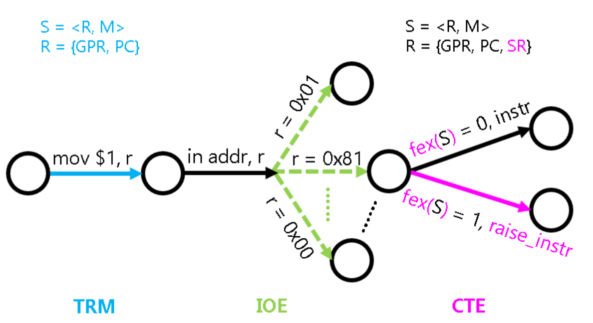
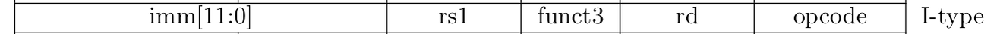
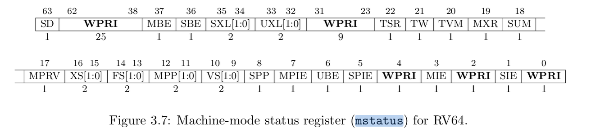
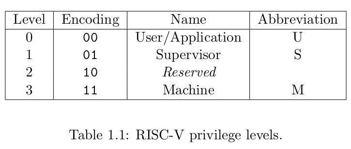
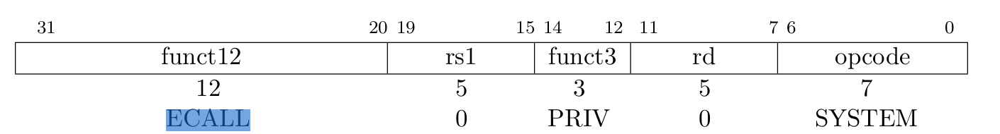
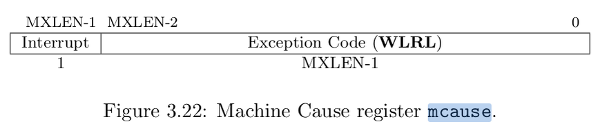
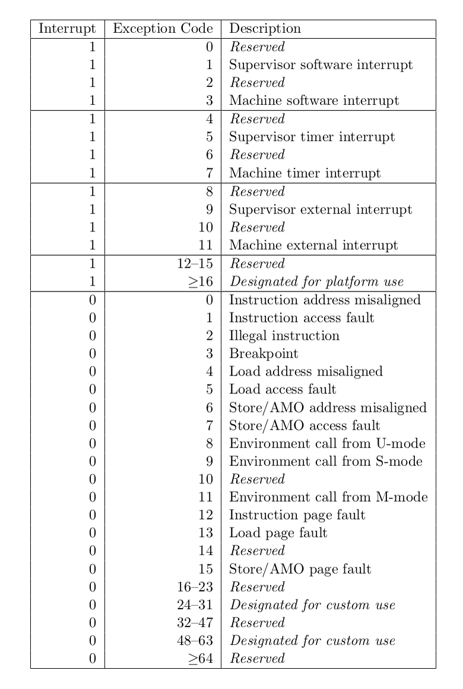
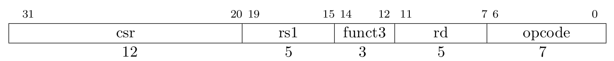
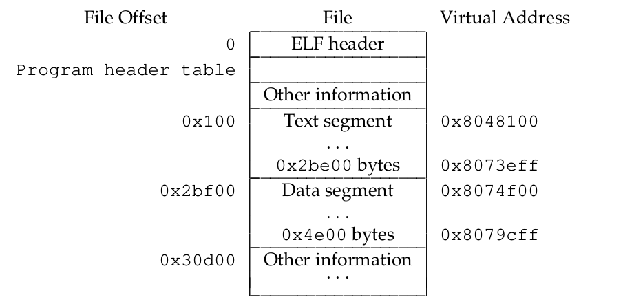

1. **为什么批处理系统会出现？**

为了让计算机自动运行一组程序


2. **TRM + IOE 的系统有什么缺陷？**

程序会独占整个计算机系统，一次只能有一个程序在运行


3. **早期计算机工作模式？**

系统管理员给计算机加载一个特定的程序(其实是上古时期的打孔卡片)，计算机就会一直执行这个程序，直到程序结束或者是管理员手动终止，然后再由管理员来手动加载下一个程序。


4. **批处理系统的诞生？**

让管理员事先准备好一组程序，让计算机执行完一个程序之后，就自动执行下一个程序

要有一个后台程序，当一个前台程序执行结束的时候，后台程序就会自动加载一个新的前台程序来执行


5. **后台处理程序就是操作系统！**


6. **最简单的操作系统？**

在PA中使用的操作系统叫Nanos-lite，它是南京大学操作系统Nanos的裁剪版


7. **获取nanos-lite的方法**

```bash
cd ics2022
bash init.sh nanos-lite
```


8. **将操作系统看作是AM上的一个普通程序！**

和超级玛丽没什么区别

Nanos-lite的实现可以是架构无关的


9. **进程和程序的区别？**

如果你打开了记事本3次，计算机上就会有3个记事本进程在运行，但磁盘中的记事本程序只有一个


10. **NEMU的log和Nanos-lite的log并不是一个东西**

在Nanos-lite中，`Log()`宏通过你在`klib`中编写的`printf()`输出，最终会调用TRM的`putch()`


11. **设备初始化 -> init_device -> ioe_init**


12. **disk 磁盘？**

先让Nanos-lite把其中的一段内存作为磁盘来使用

这样的磁盘有一个专门的名字，叫ramdisk


13. **运行 nanos-lite**

```bash
make ARCH=riscv64-nemu run
make ARCH=native run
```


14. **操作系统就是一个C程序**

GNU/Linux只不过是个巨大的C程序而已


15. **一个最简单的操作系统？**

- 用户程序执行结束之后，可以跳转到操作系统的代码继续执行
- 操作系统可以加载一个新的用户程序来执行


16. **执行流的切换？**

函数调用一般是在一个程序内部发生的(动态链接库除外)，属于程序内部的执行流切换，使用call/jal指令即可实现。

执行流切换的本质，也只是把PC从一个值修改成另一个值而已。


17. **为什么操作系统和用户程序之间的切换不能简单点，将操作系统作为一个特殊的库函数，通过函数调用来进行执行流切换？**

- 一个用户程序出错了，操作系统可以运行下一个用户程序。
- 但如果操作系统崩溃了，整个计算机系统都将无法工作。
- 人们还是希望能把操作系统保护起来，尽量保证它可以正确工作。
- 我们都不希望用户程序可以把执行流切换到操作系统中的任意函数


18. **为什么会出现硬件上的权限管理机制？**

为了阻止程序将执行流切换到操作系统的任意位置

- i386中引入了保护模式(protected mode)和特权级(privilege level)
- mips32处理器可以运行在内核模式和用户模式
- riscv32则有机器模式(M-mode)，监控者模式(S-mode)和用户模式(U-mode)

有高特权级的程序才能去执行一些系统级别的操作

如果一个特权级低的程序尝试执行它没有权限执行的操作，CPU将会抛出一个异常信号，来阻止这一非法行为的发生


19. **操作系统和用户程序的特权级？**

- 操作系统拥有最高的特权级
- 运行在操作系统上的用户程序一般都处于最低的特权级


20. **RISCV 的特权级？**

它存在M，S，U三个特权模式，分别代表机器模式，监管者模式和用户模式。

M模式特权级最高，U模式特权级最低，低特权级能访问的资源，高特权级也能访问。

- 操作系统运行在S模式，因此有权限访问所有的代码和数据。
- 而一般的程序运行在U模式，这就决定了它只能访问U模式的代码和数据。
- 只要操作系统将其私有代码和数据放S模式中，恶意程序就永远没有办法访问到它们。


21. **如何判定进程执行了无权限的操作？即跳转到了不应该访问的函数？**

在硬件上维护一个用于**标识当前特权模式的寄存器**

在访问那些高特权级才能访问的资源时，对当前特权模式进行检查


22. **如何出现了非法的特权级访问，会发生什么？**

CPU将会抛出异常信号，并跳转到一个和操作系统约定好的内存位置，交由操作系统进行后续处理


23. **其他指令集的架构的特权级？**

-  x86的操作系统运行在ring 0，用户进程运行在ring 3。
- mips32的操作系统运行在内核模式，用户进程运行在用户模式。

这些保护相关的概念和检查过程都是通过硬件实现的。


24. **特权级保护机制的本质？**

 在硬件中加入一些与特权级检查相关的门电路(例如比较器电路)，如果发现了非法操作，就会抛出一个异常信号，让CPU跳转到一个约定好的目标位置，并进行后续处理。


25. **硬件漏洞？**

https://meltdownattack.com/

Meltdown and Spectre

它们打破了特权级的边界:  恶意程序在特定的条件下可以以极高的速率窃取操作系统的信息


26. **性能还是安全？**

没有安全，芯片跑得再快，也是徒然


27. **trap指令的实现**

程序执行自陷指令之后，就会陷入到操作系统预先设置好的跳转目标。

这个跳转目标也称为异常入口地址。

这一过程是ISA规范的一部分，称为中断/异常响应机制。

大部分ISA并不区分CPU的异常和自陷！


28. **三种常见指令集的trap机制？**

- **x86** 

提供`int`指令作为自陷指令

异常入口地址是通过门描述符(Gate Descriptor)来指示的

门描述符是一个8字节的结构体，简化图：

```
   31                23                15                7                0
  +-----------------+-----------------+---+-------------------------------+
  |           OFFSET 31..16           | P |          Don't care           |4
  +-----------------------------------+---+-------------------------------+
  |             Don't care            |           OFFSET 15..0            |0
  +-----------------+-----------------+-----------------+-----------------+
```

- **P位**来用表示这一个门描述符是否有效
- **OFFSET**用来指示异常入口地址

用户程序就只能跳转到门描述符中OFFSET所指定的位置

x86把内存中的某一段数据专门解释成一个数组，叫IDT(Interrupt Descriptor Table，中断描述符表)。

```
           |               |
           |   Entry Point |<----+
           |               |     |
           |               |     |
           |               |     |
           +---------------+     |
           |               |     |
           |               |     |
           |               |     |
           +---------------+     |
           |offset |       |     |
           |-------+-------|     |
           |       | offset|-----+
  index--->+---------------+
           |               |
           |Gate Descriptor|
           |               |
    IDT--->+---------------+
           |               |
           |               |
```

数组的一个元素就是一个门描述符。

为了从数组中找到一个门描述符，我们还需要一个索引。

这个索引**由CPU内部产生(例如除零异常为0号异常)**，或者**由`int`指令给出(例如`int $0x80`)**

x86使用**IDTR寄存器来存放IDT的首地址和长度**

执行一条特殊的指令`lidt`，来在IDTR中设置好IDT的首地址和长度

ldt + offset  -> entry


通过`int3`触发的断点异常需要返回到程序的当前状态继续执行，所以需要在进行响应异常的时候保存好程序当前的状态。


**触发异常后硬件的响应过程如下:**

1. 从IDTR中读出IDT的首地址
2. 根据异常号在IDT中进行索引, **找到一个门描述符**
3. 将门描述符中的offset域组合成**异常入口地址**
4. 依次将eflags，cs(代码段寄存器)，**eip(也就是PC)寄存器**的值压栈
5. 跳转到异常入口地址


- **mips**

提供`syscall`指令作为自陷指令

mips32约定，异常入口地址总是`0x80000180`

 mips32提供了一些特殊的系统寄存器，

这些寄存器位于0号协处理器(Co-Processor 0)中，因此也称CP0寄存器。

重要的有三个：

- epc寄存器 - 存放触发异常的PC
- status寄存器 - 存放处理器的状态
- cause寄存器 - 存放触发异常的原因

触发异常后硬件的响应过程如下：

1. 将当前PC值保存到epc寄存器
2. 在cause寄存器中**设置异常号**
3. 在status寄存器中**设置异常标志,**，使处理器进入内核态
4. 跳转到`0x80000180`


- **riscv**

提供`ecall`指令作为自陷指令

提供一个mtvec寄存器来存放异常入口地址

提供了一些特殊的系统寄存器，叫控制状态寄存器(CSR寄存器)。

三个特殊的CSR寄存器：

- mepc寄存器 - 存放触发异常的**PC**
- mstatus寄存器 - 存放处理器的**状态**
- mcause寄存器 - 存放触发异常的**原因**

触发异常后硬件的响应过程如下：

1. 将当前P**C值保存**到mepc寄存器
2. 在mcause寄存器中**设置异常号**
3. 从mtvec寄存器中**取出异常入口地址**
4. **跳转到异常入口**地址


上述保存程序状态以及跳转到异常入口地址的工作，**都是硬件自动完成的**，不需要程序员编写指令来完成相应的内容。

处理过程将会由操作系统来接管，操作系统将视情况决定是否终止当前程序的运行**(例如触发段错误的程序将会被杀死)**

若决定无需杀死当前程序，等到异常处理结束之后，**就根据之前保存的信息恢复程序的状态**，并从异常处理过程中返回到程序触发异常之前的状态。


29. **三种指令集的异常处理返回？**

- x86通过**`iret`**指令从异常处理过程中返回，它**将栈顶的三个元素来依次解释成eip，cs，eflags，并恢复它们**。
- mips32通过**`eret`**指令从异常处理过程中返回，它将清除status寄存器中的异常标志，**并根据epc寄存器恢复PC。**
- riscv32通过**`mret`**指令从异常处理过程中返回，它将**根据mepc寄存器恢复PC。**


30. **状态机视角的异常响应机制？**

TRM + IOE -> S = <R, M> 

R = {GPR, PC, SR}

 异常响应机制和内存无关，因此我们无需对`M`的含义进行修改。


（1）**对R进行扩充**

除了PC和通用寄存器之外，还需要添加上文提到的**一些特殊寄存器**

系统寄存器(System Register)

**R = {GPR, PC, SR}**


（2）**状态转移的修正**

为了描述指令执行失败的行为，我们可以假设CPU有一条虚构的指令`raise_intr`

```
SR[mepc] <- PC
SR[mcause] <- 一个描述失败原因的号码
PC <- SR[mtvec]
```

- 如果一条指令执行成功，其行为和之前介绍的TRM与IOE相同。
- 如果一条指令执行失败，其行为**等价于执行了虚构的`raise_intr`指令**。

==通过引入虚构的raise_intr 指令可以保证每次指令执行都是“成功”的！==

 "一条指令的执行是否会失败"这件事是不是确定性的呢?

- 非法指令可以定义成"不属于ISA手册描述范围的指令"
- 而自陷指令可以认为是一种特殊的无条件失败

RISC-V手册就不认为除0是一种失败。

**因此即使除数为0，在RISC-V处理器中这条指令也会按照指令手册的描述来执行**


**（3）失败条件的数学表示**

```
fex: S -> {0, 1}
```

给定状态机的任意状态`S`，`fex(S)`都可以**唯一表示当前PC指向的指令是否可以成功执行**

- 一个程序运行多次，还是会在相同的地方抛出相同的异常，从而进行相同的状态转移
- IOE的输入指令会引入一些不确定性


**（4）添加了CTE后的计算机系统状态机表示**




**（5）为了管理系统寄存器，需要添加特殊的系统指令**

例如x86的`lidt`，`iret`，riscv的`csrrw`，`mret`等。

这些指令**除了用于专门对状态机中的`SR`进行操作之外**，它们本质上和TRM的计算指令没有太大区别。

TRM的普通计算指令作用于GPR 和 PC，而为了实现CTE的系统指令作用于SR！


31. **上下文管理的抽象？CTE**

ConText Extension

硬件提供的上述在操作系统和用户程序之间切换执行流的功能，

在操作系统看来，都可以划入上下文管理的一部分。

与IOE一样，上下文管理的具体实现也是架构相关的。

x86/mips32/riscv32中分别通过`int`/`syscall`/`ecall`指令来进行自陷。


32. **操作系统处理一个异常需要哪些信息？**

**（1）引发这次执行流切换的原因**

是程序除0，非法指令，还是触发断点，又或者是程序自愿陷入操作系统

根据不同的原因，操作系统都会进行不同的处理


**（2）程序的上下文**

读出上下文中的一些寄存器，根据它们的信息来进行进一步的处理


33. **通过异常机制，通过软件模拟浮点指令的执行？**

去掉浮点处理单元FPU来节省功耗。

如果软件要执行一条浮点指令，处理器就会抛出一个非法指令的异常。

有了异常响应机制，我们**就可以在异常处理的过程中模拟这条非法指令的执行了。**


34. **目前的AM中的浮点指令的执行是UB**

你也可以考虑实现一个简化版的FPU。

如果你的FPU行为正确，也不算违反规定。


35. **stackoverflow 也是UB**


36. **AM究竟给程序提供了多大的栈空间呢?** 


37. **实现CTE的数据结构？**

CTE定义了名为"事件"的如下数据结构。

```c#
typedef struct Event {
  enum { ... } event;
  uintptr_t cause, ref;
  const char *msg;
} Event;
```

其中`event`表示事件编号，`cause`和`ref`是一些描述事件的补充信息，`msg`是事件信息字符串


在AM中，`Context`的具体成员也是由不同的架构自己定义的。

- 操作系统并不需要单独访问`Context`结构中的成员。
- CTE也提供了一些的接口，来让操作系统在必要的时候访问它们，
- 从而**保证操作系统的相关代码与架构无关**。


38. **实现CTE的统一API？**

**（1）cte_init**

```c
bool cte_init(Context* (*handler)(Event ev, Context *ctx))
```

**定义某个事件的处理回调函数，参数就是event和上下文ctx。**


**（2）yield**

```c
void yield()
```

**会触发一个编号为`EVENT_YIELD`事件。不同的ISA会使用不同的自陷指令来触发自陷操作。**


39. **一个完整的触发trap的操作过程？**

**（1）设置异常的入口地址是架构相关的行为，不能放入操作系统，需要放入AM的CTE中。**

使用HAS_CTE宏，然后就会通过init_irq 执行 cte_init，完成异常入口地址的初始化。

- 对x86来说，就是要准备一个有意义的IDT。
- 对于mips32来说，由于异常入口地址是固定在`0x80000180`，因此我们需要在`0x80000180`放置一条无条件跳转指令，使得这一指令的跳转目标是我们希望的真正的异常入口地址即可。
- 对于riscv32来说，**直接将异常入口地址设置到mtvec寄存器中即可。**

```c
asm volatile("csrw mtvec, %0" : : "r"(__am_asm_trap));
```

`cte_init()`函数做的第二件事是注册一个事件处理回调函数，这个回调函数由Nanos-lite提供


**（2）我们还需要真正触发一次自陷操作**

需要在NEMU中实现`isa_raise_intr()`函数。

模拟异常响应机制。


40. **让DiffTest支持异常响应机制**

- 针对riscv64，你需要将mstatus初始化为`0xa00001800`.


41. **实现指令**

```c
30 57 10 73 csrrw   zero, mtvec, a4
0011 0000 0101 0111 0001 0000 0111 0011
0011_0000_0101 01110 001 00000 1110011
```




All CSR instructions atomically **read-modify-write** a single CSR, **whose CSR specifier is encoded in the 12-bit csr field of the instruction held in bits 31–20**. The immediate forms use a 5-bit **zero-extended** immediate encoded in the rs1 field.

The **CSRRW** (Atomic Read/Write CSR) instruction atomically **swaps values** in the CSRs and integer registers. CSRRW **reads the old value of the CSR, zero-extends the value to XLEN bits**, then **writes it to integer register rd**. The initial value in rs1 is written to the CSR. **If rd=x0, then the instruction shall not read the CSR and shall not cause any of the side effects that might occur on a CSR read**.

**The assembler pseudoinstruction** to write a CSR, CSRW csr, rs1, is encoded as **CSRRW x0, csr, rs1**

```assembly
csrrw rs1, csr, rd
```

```c
if(rd!=0) {
    csr -> tmp (zero-extends) -> rd
    rs1 -> csr
}
```


42. **设置寄存器 mstatus为 0xa00001800**

The mstatus register keeps track of and controls **the hart’s current operating state**. A restricted view of mstatus appears as the sstatus register in the S-level ISA.



```
0xa00001800
1010_0000_0000_0000_0000_0001_1000_0000_0000
```

- MPP = 11
- SXL = 10
- UXL = 10

For RV64 systems, the **SXL** and **UXL** fields are WARL fields that control the value of XLEN for S-mode and U-mode, respectively.

the MPP field is set to the (nominal) **privilege** mode **at the time of the trap**, the MPV bit is set to the value of the virtualization mode V at the time of the trap




43. **实现ecall指令**

```c
00000073          	ecall
```


The ECALL instruction is used to make a service request to the execution environment.



We use the term **exception** to refer to **an unusual condition occurring** at run time associated **with an instruction** in the current RISC-V hart. 

We use the term **interrupt** to refer to an **external asynchronous event** that may cause a RISC-V hart to experience an unexpected transfer of control. 

We use the term **trap** to refer to the transfer of control **to a trap handler** caused by either an exception or an interrupt.

For example, in an EEI providing both **supervisor** and **user** mode on harts, an **ECALL** by a user-mode hart will generally result in **a transfer of control to a supervisor-mode handler** running on the same hart


44. **mcause**

When a trap is taken into M-mode, mcause is written with a code indicating the event that caused the trap. Otherwise, mcause is never written by the implementation, though it may be explicitly written by software.



**The Interrupt bit** in the mcause register is set if the trap was caused by an interrupt. 

**The Exception Code field** contains a code identifying the last exception or interrupt.




**45. 实现指令 csrrs**

```c
34 20 22 f3 csrrs   t0, mcause, zero
```




The CSRRS (Atomic Read and Set Bits in CSR) instruction **reads the value of the CSR**, **zero-extends the value to XLEN bits**, and writes it to integer register **rd**. The initial value in integer register rs1 is treated as a **bit mask** that specifies bit positions to be set in the CSR. **Any bit that is high in rs1 will cause the corresponding bit to be set in the CSR**, if that CSR bit is writable. **Other bits** in the CSR **are not explicitly written**

- csr -> tmp (zero-extends) -> rd
- csr = csr | rs1


46. **进入traphandler的之前需要保存上下文寄存器信息，需要注意顺序！**

x86提供了`pusha`指令，用于把通用寄存器的值压栈。

mips32和riscv32则通过`sw`指令将各个通用寄存器依次压栈。


47. **上下文信息包括？**

**（1）通用寄存器**

**（2）触发异常时的PC和处理器状态**

对于x86来说就是eflags，cs和eip

对于mips32和riscv32来说，就是**epc/mepc**和**status/mstatus**寄存器

**（3）异常号**

对于x86，异常号由软件保存

对于mips32和riscv32，异常号已经由硬件保存在cause/mcause寄存器中，我们还需要将其保存在堆栈上

**（4）地址空间**

暂时忽略


异常处理过程可以根据上下文来诊断并进行处理，同时，将来恢复上下文的时候也需要这些信息


48. **异常处理和函数调用的区别？**

异常处理还需要保存额外的信息


49. **触发异常，跳转到 __ am_asm_trap ，然后跳转到  __ am_irq_handle**


50. **do_event进行事件的分发，也就是实际的异常处理回调函数**


51. **上下文的恢复**

`__am_asm_trap()`将根据之前保存的上下文内容，恢复程序的状态。

最后执行"**异常返回指令**"返回到程序触发异常之前的状态。


52. **trap的时候保存的PC对于不同的指令集架构是不同的**

对于x86的`int`指令，保存的是指向其下一条指令的PC，这有点像函数调用。

对于mips32的`syscall`和riscv32的`ecall`，**保存的是自陷指令的PC，因此软件需要在适当的地方对保存的PC加上4，使得将来返回到自陷指令的下一条指令。**


53. **缺页异常返回后的PC不能加4**

- 在系统将故障排除后，将会重新执行相同的指令进行重试，因此异常返回的PC无需加4。
- 所以根据异常类型的不同，有时候需要加4，有时候则不需要加。


54. **是否需要加4？**

1）CISC

交给硬件来做

2）RISC

交给软件来做


55. **添加新的指令 mret**


就是将pc 设置为 epc，但是具体epc是否需要加4，需要在软件中进新设置！


56. **添加etrace，即描述异常处理的踪迹**

不要在AM的 CTE 中添加etace，而是在NEMU中添加！


57. **加载用户程序**

程序中包括代码和数据，它们都是存储在可执行文件中。

为了实现loader函数，需要考虑下面4个问题：

- 可执行文件在哪里?
- 代码和数据在可执行文件的哪个位置?
- 代码和数据有多少?
- "正确的内存位置"在哪里?


由于运行时环境的差异，我们不能把编译到AM上的程序放到操作系统上运行

需要将程序转化为 **“能够运行在操作系统上的用户程序”**！


58. **添加Navy-apps**

https://github.com/NJU-ProjectN/navy-apps

```bash
cd ics2022
bash init.sh navy-apps
```


59. **newlib**

https://sourceware.org/newlib/

navy-apps/libs/libc


60. **程序入口**

navy-apps/libs/libos/src/crt0/start/$ISA.S 的 _start 函数

ctr0 的 ctr 就是 C RunTime

`_start()`函数会调用`navy-apps/libs/libos/src/crt0/crt0.c`中的`call_main()`函数，

然后调用用户程序的`main()`函数，从`main()`函数返回后会调用`exit()`结束运行。


61. **运行第一个用户程序 dummy**

在`navy-apps/tests/dummy/`目录下执行

```shell
make ISA = riscv64
```

编译成功后把`navy-apps/tests/dummy/build/dummy-riscv64`手动复制并重命名为`nanos-lite/build/ramdisk.img`, 然后在`nanos-lite/`目录下执行

```shell
make ARCH=riscv64-nemu
```


ramdisk镜像文件包含在了nanos-lite中，成为了其一部分。

`nanos-lite/src/resources.S`


62. **可执行文件在哪里？**

位于ramdisk偏移为0处，访问它就可以得到用户程序的第一个字节。


63. **可执行文件的组织？**

ELF文件格式包含程序本身的代码和静态数据，还包括一些用来描述它们的信息

不同组织形式形成了不同格式的可执行文件

例如

- Windows主流的可执行文件是PE(Portable Executable)格式
- GNU/Linux主要使用ELF(Executable and Linkable Format)格式

ELF是GNU/Linux可执行文件的标准格式

https://stackoverflow.com/questions/2171177/what-is-an-application-binary-interface-abi


64. **堆和栈没有放入可执行文件中，而是通过AM进行管理**


65. **两种视角看待一个可执行ELF文件**

- 面向链接过程的section视角，这个视角提供了用于**链接与重定位**的信息(例如符号表)
- 面向执行的segment视角，这个视角提供了用于**加载可执行文件**的信息

一个segment可能由0个或多个section组成，但一个section可能不被包含于任何segment中


66. **加载程序需要关注segment的视角**

ELF中采用program header table来管理segment，program header table的一个表项描述了一个segment的所有属性，包括**类型，虚拟地址，标志，对齐方式，以及文件内偏移量和segment大小**。


67. **通过PT_LOAD来判断一个segment是否需要加载**

加载一个可执行文件并不是加载它所包含的所有内容，只要加载那些与运行时刻相关的内容就可以了，例如调试信息和符号表就不必加载。


68. **FileSize 和 MemSize ？**

一些bss段在磁盘上是不占用空间的，但是一旦加载到内存就会占用空间。

所以 MemSize >= FileSize


69. **程序从何而来？**

https://www.tenouk.com/ModuleW.html#google_vignette


70. **如何加载一个segment**

```
      +-------+---------------+-----------------------+
      |       |...............|                       |
      |       |...............|                       |  ELF file
      |       |...............|                       |
      +-------+---------------+-----------------------+
      0       ^               |              
              |<------+------>|       
              |       |       |             
              |       |                            
              |       +----------------------------+       
              |                                    |       
   Type       |   Offset    VirtAddr    PhysAddr   |FileSiz  MemSiz   Flg  Align
   LOAD       +-- 0x001000  0x03000000  0x03000000 +0x1d600  0x27240  RWE  0x1000
                               |                       |       |     
                               |   +-------------------+       |     
                               |   |                           |     
                               |   |     |           |         |       
                               |   |     |           |         |      
                               |   |     +-----------+ ---     |     
                               |   |     |00000000000|  ^      |   
                               |   | --- |00000000000|  |      |    
                               |   |  ^  |...........|  |      |  
                               |   |  |  |...........|  +------+
                               |   +--+  |...........|  |      
                               |      |  |...........|  |     
                               |      v  |...........|  v    
                               +-------> +-----------+ ---  
                                         |           |     
                                         |           |    
                                            Memory
```

相对文件偏移`Offset`指出相应segment的内容从ELF文件的第`Offset`字节开始，在文件中的大小为`FileSiz`，它需要被分配到以`VirtAddr`为首地址的虚拟内存位置，在内存中它占用大小为`MemSiz`。

注意MemSiz 多出来的部分需要清0

这个segment使用的内存就是`[VirtAddr, VirtAddr + MemSiz)`这一连续区间

- 然后将segment的内容从ELF文件中**读入到这一内存区间**，

- 并**将**`[VirtAddr + FileSiz, VirtAddr + MemSiz)`**对应的物理区间清零**。


71. **实现一个 loader可能需要用的接口**

```c
// 从ramdisk中`offset`偏移处的`len`字节读入到`buf`中
size_t ramdisk_read(void *buf, size_t offset, size_t len);

// 把`buf`中的`len`字节写入到ramdisk中`offset`偏移处
size_t ramdisk_write(const void *buf, size_t offset, size_t len);

// 返回ramdisk的大小, 单位为字节
size_t get_ramdisk_size();
```


72. **程序的本质？**

程序的最为原始的状态：比特串

加载程序其实就是**把这一毫不起眼的比特串放置在正确的位置**，但这其中又折射出"**存储程序**"的划时代思想。

操作系统将控制权交给它的时候, 计算机把它解释成指令并逐条执行。

loader让计算机的生命周期突破程序的边界：

一个程序结束并不意味着计算机停止工作，**计算机将终其一生履行执行程序的使命**。


73. **添加一个判定魔数的assert**

```c
assert(*(uint32_t *)elf->e_ident == 0xBadC0de);
```


74. **不仅需要让 nanos-lite在riscv64-nemu上跑起来，还需要在native上跑起来**


75. **elf文件的手册和资料**

```shell
man 5 elf
```


76. **实现loader需要看的**

- init_proc
- -> loader
- -> naive_uload


77. **Executable File format**




