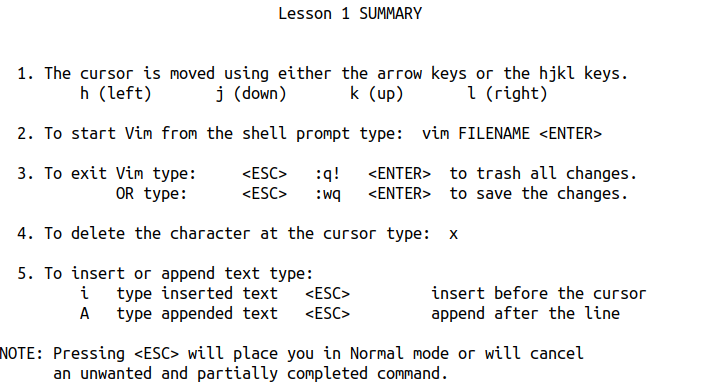
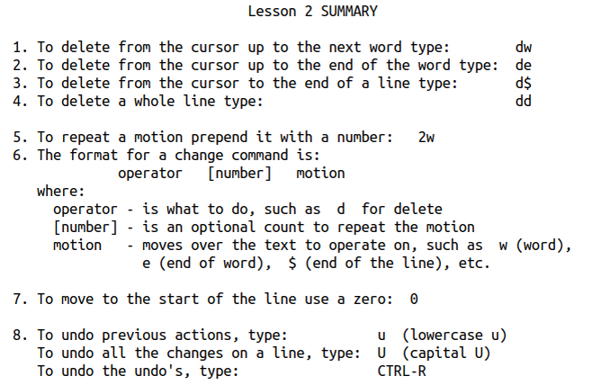
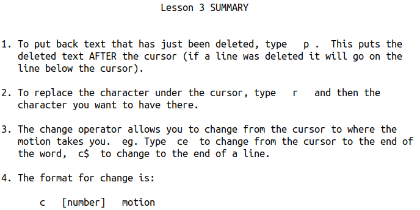
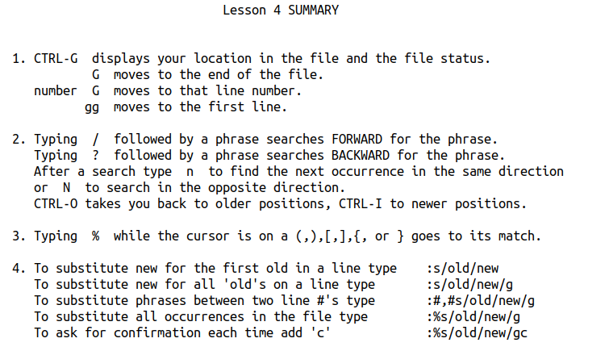
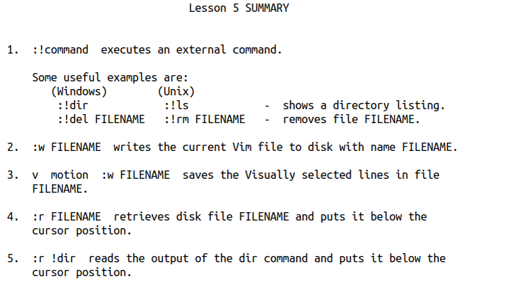
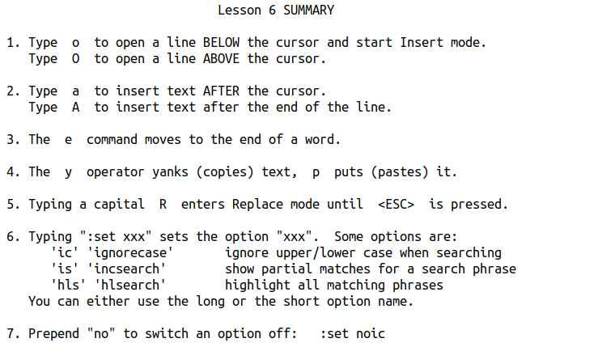
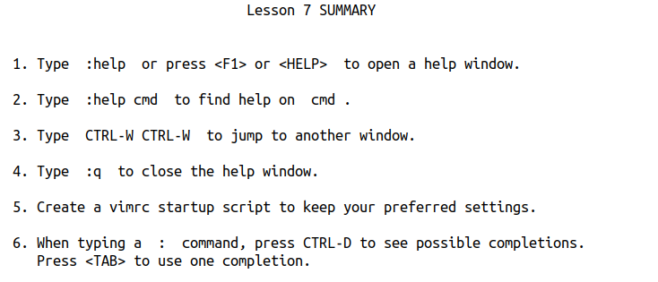

### Lesson 1

1. **Normal 模式下的移动**

h ： 左侧移动

l：右侧移动

j：下移动

k：上移动


2. **退出**

```
:q!
```


3. **删除**

press 'x'


4. **插入**

press 'i' to insert


5. **末尾添加**

press 'A' to append


6. **保存文本**

```
:wq
```




------

### Lesson 2

1. **删除一个单词**

dw


2. **末尾删除**

d$


3. **不同的删除模式**

d w

删除后面的一个单词

d e

删除后面的一个字符

d $

删除后面一整行


4. **使用数字进行移动**

先按数字，然后再进行一些动作，就可以执行多次

2w：移动两个单词，且是单词的第一个字母

3e：移动三个单词，且是单词的末尾

0：移动到当前行的第一个字符位置


5. **使用数字进行删除**

d 2 w 就是删除两个单词


6. **删除多行**

3 dd 就是删除连续的三行


7. **撤消：**

u：撤消一个字符

U：撤消一整行




------

### Lesson 3


1. **放置删除寄存器中的数据**

先dd删除一行，然后将其放入下一行

press  'p'


2. **替换字符**

press 'r'，then press the character it should be 


3. **修改一个单词** 和 **修改一整行**

c e

c c


4. **和删除一样的 修改**

c w 单词 

c $ end of the line




------

### Lesson 4

1. **游标移动**

G ：移动到文件的末尾

gg：移动到文件的开头

行号 G：移动到特定行

ctrl-G：显示游标的位置（行和列）


2. **全文搜索**

/ + 搜索的内容（向下查找）

n ：下一个

N：上一个

? + 搜索的内容（向上查找）


3. **左右括号匹配**

括号：(  [ {

将游标移动到一个括号上，然后按下%，就可以将游标跳转到 对应的另一个括号上

This is very useful in **debugging a program with unmatched parentheses**


4. **替换**

```
:s/old/new
```

替换一个

```
:s/old/new/g
```

替换一行

```
:#,#s/old/new/g
```

替换一个范围（# 就代表行号）

```
:%s/old/new/g
```

全文件替换

```
:%s/old/new/gc
```

全文件替换，但是会有yes or no 的选择





补充：

- ctrl + - ：缩小
- ctrl + shift + = ：放大


------

### Lesson 5


1. **执行shell指令**

```
:! 指令
```


2. **写入文件**

```
:w TEST
```

就是将当前文件内容写入另一个文件


3. **选中文本写入文件**

先按下 v 进入 virtual 

然后移动cursor，就会发现文本被高亮选中

最后按下  :  ，然后 是 w TEST 就可以将选中的文本保存到一个新的文件中


4. **读取数据流到游标位置**

```
:r TEST
```

将文本TEST中的内容写入游标的位置

```
:r !ls
```

将ls的数输出写入游标的位置





------

### Lesson 6

1. **移动游标重开一行插入**

o ：在下面重开一行插入

O：在上面重开一行插入


2. **在游标后面插入文本**

e：移动游标一个单词

a：在游标后面添加


3. **开启替换模式**

press 'R'


4. **结合virtual 模式进行复制粘贴**

先按 v 进入virtual 模式

然后 移动 游标选中高亮文本，然后按 y （yank）复制

最后移动游标到特定位置粘贴（按下 p）


5. **设置选项**

主要针对查找和替换。

```
:set ic
```

ignore case ：忽略大小写

```
:set hls is
```

hight light ：高亮

```
:set noic
```

取消上面的设置



------

### Lesson 7

1. **help界面**

```
: help
```

打开界面

```
: q
```

关闭界面

```
ctrl-w
```

窗口跳转

```
: help
: help c_CTRL_D
: help insert-index
: help user-manual
```

常用


2. **特性配置**

配置文件

~/.vimrc

手册：

```
:help vimrc-intro
```

开启一些基本的配置：

```
:e ~/.vimrc
:r $VIMRUNTIME/vimrc_example.vim
:w
```


3. **命令补全**

ctrl-d ：显示可能的补全内容

<TAB>：可以进行指令补全




进一步学习：

```
:help user-manual
```

http://iccf-holland.org/click5.html

